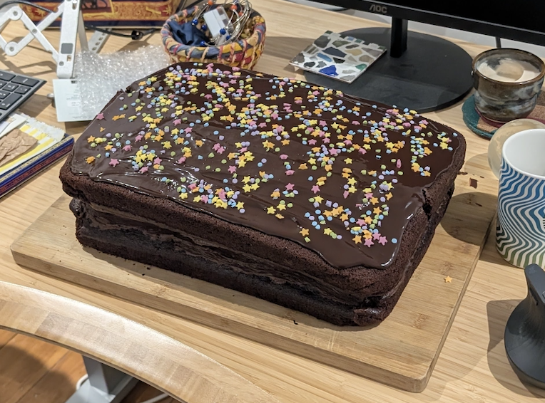
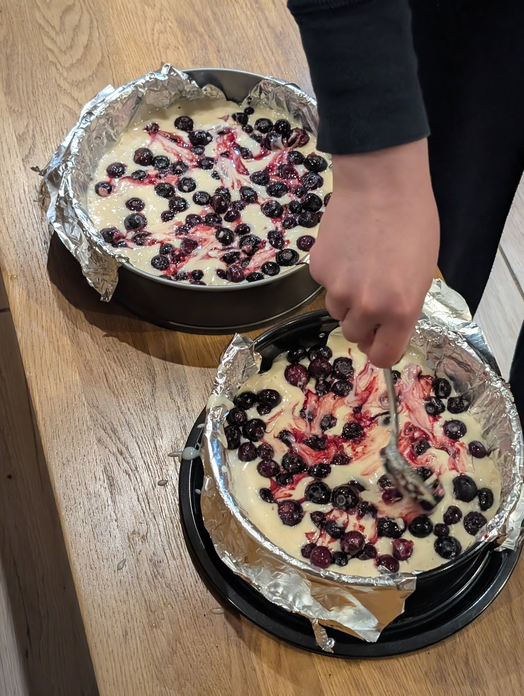
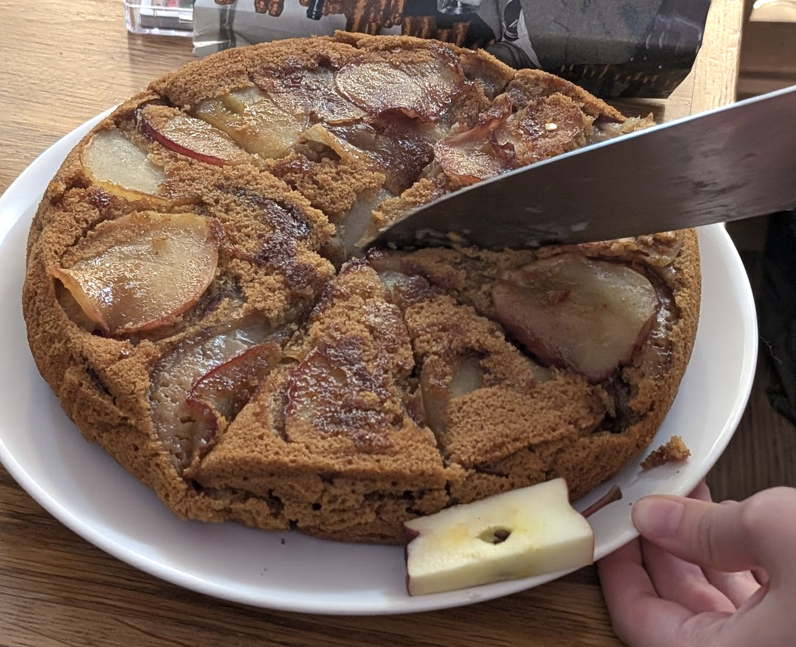
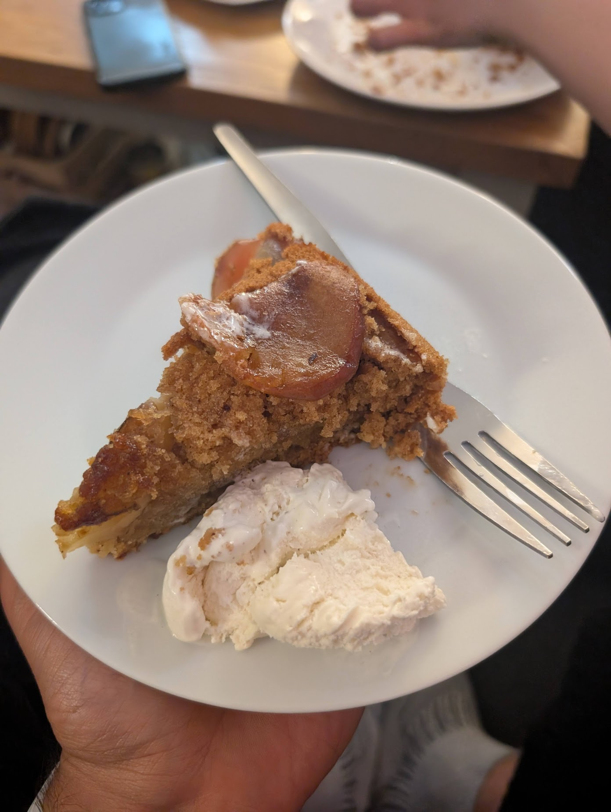
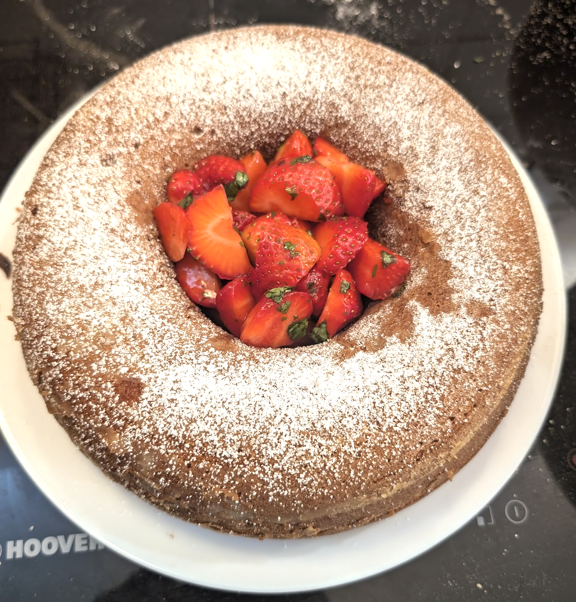
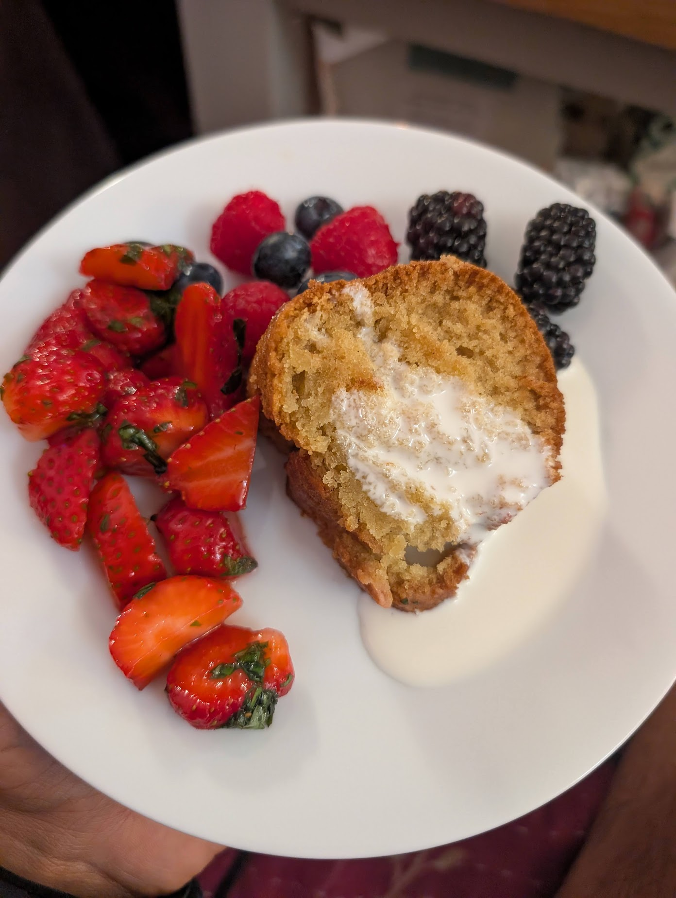

# My vegan cake recipe

My friend [Tang](https://tanglewestangle.substack.com/) has recently been training me in the art of cake baking.

## 1. My cake baking origin story

The origin story here was I was hosting a house party for my friend and housemate [Dewi](https://www.dewierwan.com/)'s birthday. He turned 29 at midnight. It felt right to bring out a cake at midnight.

Dewi, and a good number of other party attendees, were vegan. Several vegan friends of mine had previously claimed to me that vegan desserts in general were terrible, so my prior was that finding something suitable might be quite difficult. Tang claimed to me the opposite, and then fed me a vegan cake that she had baked to prove to me she was right.

I proposed collaborating on a cake for the party. We proceeded to bake the following monster 5kg vegan cake, aiming to feed ~50 or so party attendees.

It went down well.

<video controls playsinline width="100%" preload="metadata">
  <source src="img/cake/party-video.mp4" type="video/mp4">
</video>

## 2. My vegan cake recipe

Since the party, Tang and I have baked about a cake a week. My recipe is inspired by this [goodfood recipe](https://www.bbcgoodfood.com/recipes/vegan-chocolate-cake). The following basic recipe feeds 10 or so, scale up or down accordingly. For the party above, we 5x'd.

**Ingredients:**

- 150g vegan butter / oil
- 300ml vegan milk (we use oat)
- 1 tbsp acid (we use vinegar or lemon juice)
- 300g self raising flour
- 200g sugar
- 1 tsp bicarbonate of soda
- 1/2 tsp (or more) vanilla extract

**Steps:**

- Mix the dry and wet ingredients together separately.
- Mix the dry and wet ingredients together.
- De-lump the cake batter.
- Pour into a cake tin lined with tin foil.
- Bake at 190C/170C fan/gas 5 for 25-35 minutes, removing when a toothpick comes out clean.
- Optional toppings.

## 3. Flavourings

There's a lot of scope to play around with flavourings. I think it's probably hard to fuck up. Things I've tried:

**Chocolate.** Add 4 tbsp cocoa powder to the cake, top with a chocolate ganache.

**Lemon and blueberry.** Add a bunch of frozen blueberries, lemon juice, and lemon zest to the cake. Top with a lemon glaze.

**Spiced apple.** Line the bottom of the cake tin with apple and sugar, such that when you flip the cake the apple is on the top. Add cinnamon, nutmeg and allspice to the cake mix.

**Vanilla.** Plain vanilla, served with berries and oat/soy cream.

