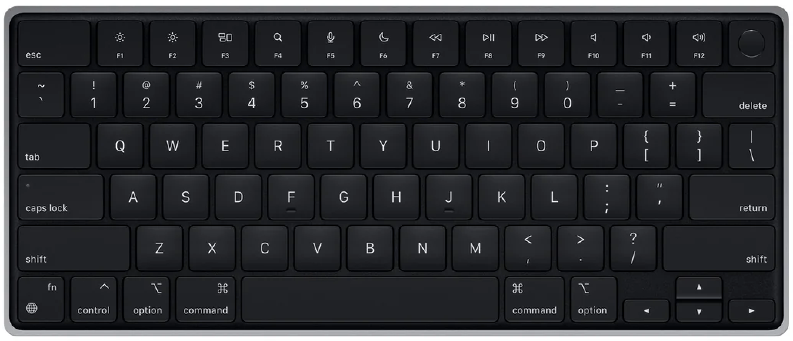

When was the last time you (intentionally) used your _caps lock_ key?

No, seriously.

Here is a typical US-layout qwerty (mac) keyboard. Notice:

1. _Caps lock_ is conveniently located only one key away from _A,_ which is where your left pinky should rest on the home row by default.
2. _Caps lock_ is absolutely massive.
3. How far various other keys you might want use often are from the home row.

**Remap your** _**caps lock**_ **key.**

I have mine mapped to _escape_. 

Modifier keys such as _control_ or _command_ are also good options (you could then map _control/command_ to _escape_).

How do I do this you ask? 

- On Mac, system settings > keyboard > keyboard shortcuts > modifier keys.
- On Windows, [Microsoft PowerToys](https://learn.microsoft.com/en-us/windows/powertoys/)' Keyboard Manager is one solution.
- If you use Linux, I trust you can manage on your own.

_Thanks to_ [_Rudolf_](https://www.lesswrong.com/users/l-rudolf-l) _for introducing me to this idea._