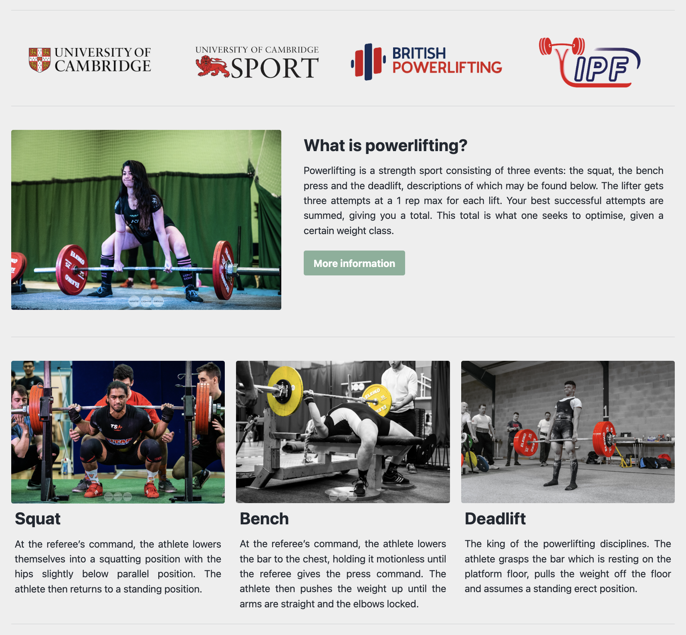
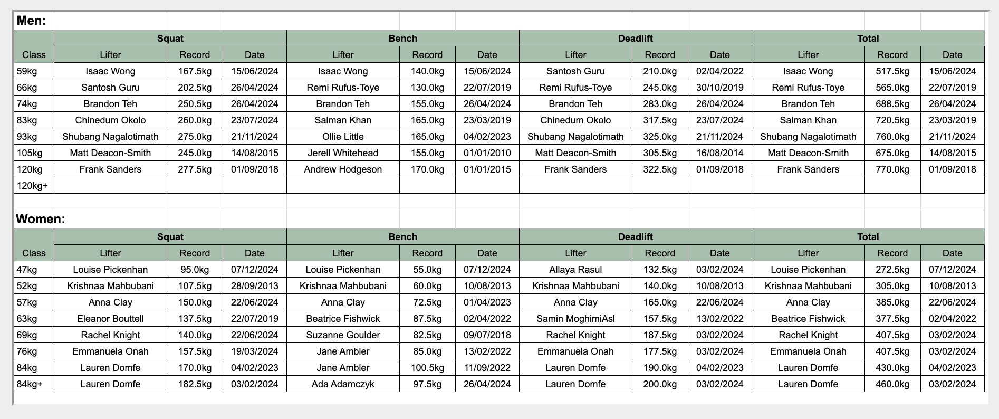

From October 2021 through October 2023 I was the webmaster of the Cambridge University Powerlifting Club (CUPLC). During this period, I contributed two major enhancements.

**Website rewrite** -- [site](https://cuplc.co.uk/), [github](https://github.com/bilal-chughtai/cuplc_site).

- A complete rewrite of the club website. 
- Built with Jekyll.

**Automation of records** -- [site](https://cuplc.co.uk/records/), [github](https://github.com/bilal-chughtai/cuplc_records).

- Scrapes [OpenPowerlifting](https://www.openpowerlifting.org/) data daily and computes records for all student and alumni weight classes.
- Python.

