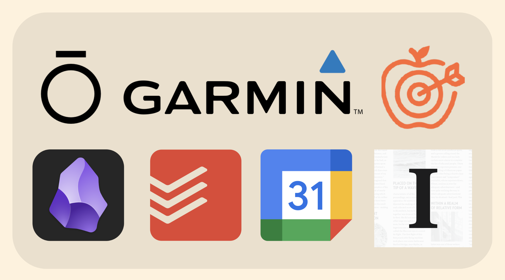
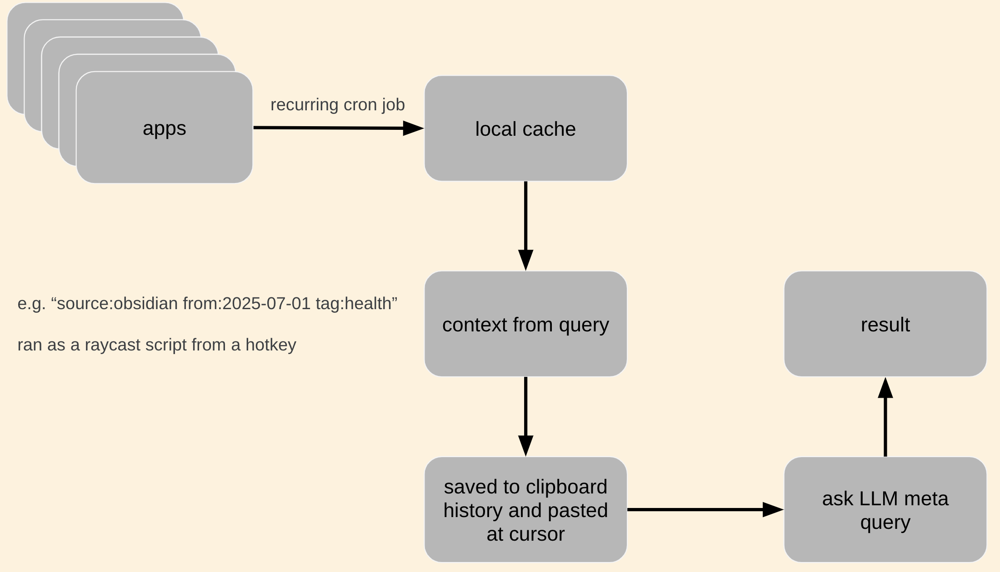
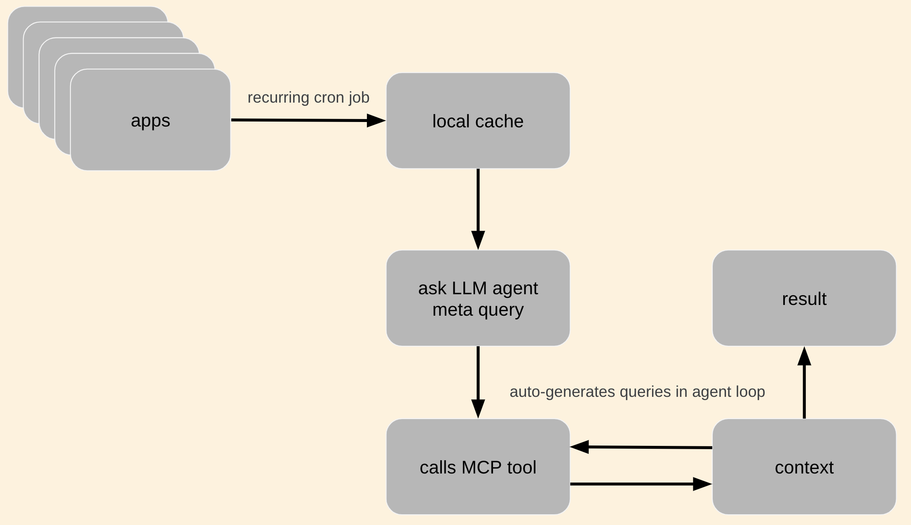
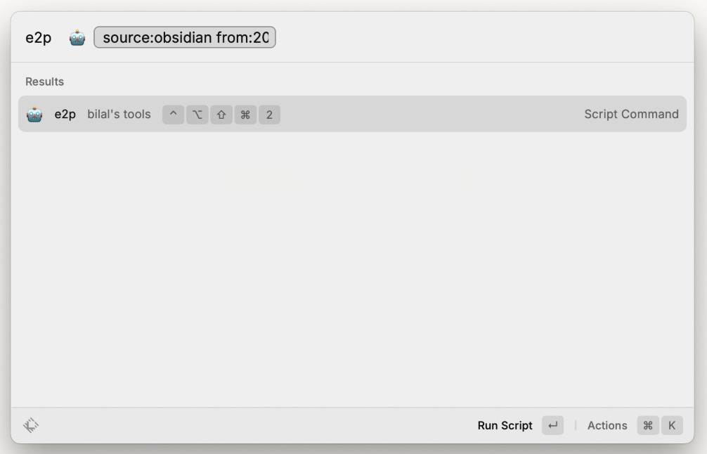
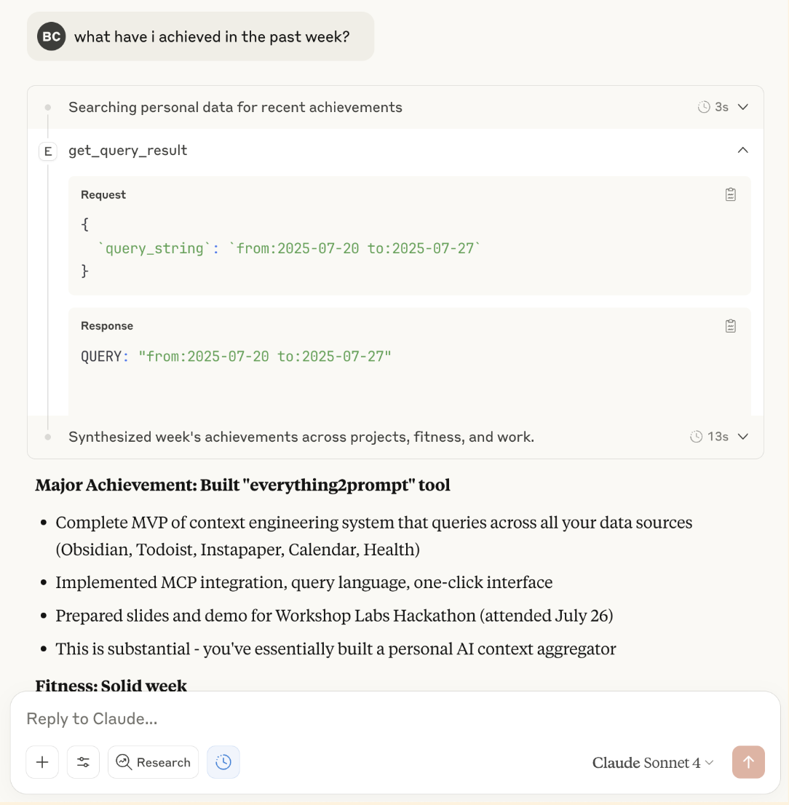
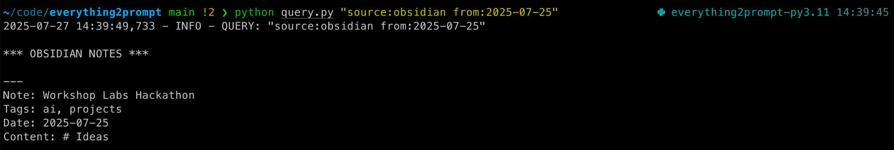

Last weekend I participated in the [Workshop Labs](https://workshoplabs.ai/) x [SOTA](https://ilikethefuture.com/) [Human Augmentation Hackathon](https://sotaletters.substack.com/p/human-augmentation-hackathon). The hackathon scope was to build tools that foster human-AI symbiosis; that augment human capabilities rather than automate us away. I built a tool I'm calling "everything2prompt", that scrapes all my personal data and turns it into easily accessible, low friction, language model context. It lets me prompt models with e.g. "write my weekly review" and get a response in seconds, without first having to find and inject the context manually myself. The project came 3rd overall of 19 projects.

# The Problem

You may have heard about prompt engineering; dialling language model prompts to elicit maximal capability on some given query. Recently, [context engineering](https://simonwillison.net/2025/Jun/27/context-engineering/) has become the new meta; providing models with the necessary information that it has not seen during training, in context, to be able to answer more sophisticated queries.

I will often want to ask LLMs questions about my personal information. My most important personal data lives in a range of apps:

- **[Obsidian](https://obsidian.md/)** (notes)
- **[Todoist](https://todoist.com/)** (task management)
- **[Google Calendar](https://calendar.google.com/)** (events and meetings)
- **[Instapaper](https://www.instapaper.com/)** (saved articles)
- **[Garmin](https://www.garmin.com/)** (activity)
- **[Oura](https://ouraring.com/)** (recovery)
- **[Cronometer](https://cronometer.com/)** (nutrition)

 It by default is high friction to impossible to get this information into LLMs. Some data can be copy pasted in as needed (e.g. Obsidian), but most cannot.
 

I wanted to build a tool that turns all of my data sources into language model context. Unfortunately I have so much personal context (~600k tokens currently and counting) that one prompt will not suffice. Some clever query-specific semantic search/filtering strategy is needed to not hit context length limits.

There do exist off the shelf tools to do this, but

- I figured it would not be that hard to roll my own. Indeed, it only took me about 8 hours to build something already very useful to me.
- Similar to my [health dashboard](https://bilalchughtai.co.uk/hd/), no off-the-shelf solution integrated all of my specific data sources.
- In general I like deleting unnecessary components from the stack and reducing complexity.
- Owning the code lets me customise/hack significantly more.

# The Solution

The core design is as follows:

- I regularly scrape data from all data sources and save it in some local cache. The cache minimises direct API requests to the data sources, and also reduces latency, as I then don't need to await API responses to grab context.
- Each cache object contains various metadata properties, that allow me to filter to only relevant cache objects at query time. The properties I include are the data source, a date, and a list of tags. Much of my data is highly structured already, so this works well.
- The cache can be queried by specifying some query using the following syntax: `source:source1,source2,... tag:tag1,tag2,... from:YYYY-MM-DD to:YYYY-MM-DD`. All fields are optional.
- I built two user interfaces:
    - Some hotkey launches a [raycast script](https://www.raycast.com/blog/getting-started-with-script-commands) that accepts a query as an argument. When ran, this pastes the grabbed context at your cursor and saves to clipboard history. 
    - A [Model Context Protocol](https://modelcontextprotocol.io/overview) (MCP) server, that allows models to write and call queries itself to grab relevant context.

# Example Use Cases

Some example prompts I have been using to demo the system:

- **"What have I achieved in the past week?"** -- Will grab from all data sources from the past week, e.g. completed todoist tasks, recent notes, calendar events, activities, etc, and write a weekly review.
- **"Write a blog post in the style of my previous blog posts about todays hackathon"** -- Will load notes on this hackathon from my Obsidian, and my prior blog posts, also in Obsidian. The first draft of this very blog post was written by Claude using this prompt.
- **"How far have I run in July 2025?"** -- Pulls health data and does a long-ish calculation that I would otherwise find annoying to do.
- **"I remember reading a blog post about X at some point, please find the link**" -- Pulls instapaper articles and searches over them. Claude will sometimes choose to filter and then read the articles itself to understand the contents too.

# Lessons Learned

- I was initially skeptical that the MCP would be that large of an improvement over manually specifying queries. I expected myself to better know what data was relevant than models would, and for this to dominate. This is true, but I neglected to consider that it is much much lower friction to use this tool if you don't even need to think about it's existence, and this matters a lot. With a carefully written prompt explaining how to use the query language and what allowed arguments are, the model is almost as good as me. MCP also scales incredibly well with model capability, and will only get better over time.
- Many projects at this hackathon should have just been MCPs, yet I was the only MCP. People like building frontends in hackathons a little too much in my opinion. It is so easy to build an MCP.
- Building things you wanted to build anyway at hackathons is great. I otherwise would not have got to this for several more weeks or months, and think it's already providing value. 
- Compared to my last hackathon, I spent far more time thinking about how exactly to demo this system and present it well. This was a good use of time. I was surprised to get feedback from both judges and other participants that my presentation was excellent; my prior was that public speaking in general was not a strong suit of mine.

# Links

Code is available [here](https://github.com/bilal-chughtai/everything2prompt). Slides are available [here](https://docs.google.com/presentation/d/1o4qZ1xlcn6tKxTNmNRS8oQdSLOd8emWLaAuNcfbsh9A/edit?slide=id.g371af394405_0_0#slide=id.g371af394405_0_0). 

I plan to spend some more time iterating on this tool over the next few weeks. But I'll note that I plan to write non-general code that works for my set of data sources and the precise ways I use them. I expect it should not be hard to fork and adapt the code to work with different ways of using the data sources I use or add new data sources entirely.

# Screenshots

 

*Thanks to Workshop Labs and SOTA for hosting, and to all the participants for an entertaining weekend. Thanks to Salman for chatting through the idea with me beforehand.*
