When you think you've found a circuit in a language model, how do you know if it does what you think it does? Typically, you [ablate / resample](https://www.lesswrong.com/posts/caZ3yR5GnzbZe2yJ3/how-to-do-patching-fast#Node_Patching) the activations of the model in order to isolate the circuit. Then you measure if the model can still perform the task you're investigating.

We identify six ways in which ablation experiments often vary.

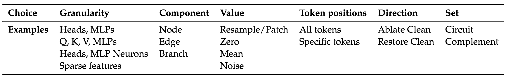

How do these variations change the results of experiments that measure circuit faithfulness?

## TL;DR

- We study three different circuits from the literature and find that measurements of their faithfulness are highly dependent on details of the experimental methodology. The IOI and Docstring circuits in particular are much less faithful than reported when tested with a more precise methodology.
- The correct circuit for a set of prompts is undefined. The type of ablation you use to isolate the circuit determines the task that you are asking the circuit to perform - and therefore also the optimal circuit.
- This is especially important because previous work in automatic circuit discovery has tested algorithms by their ability to recover these "ground-truth" circuits from the literature - without considering these potential pitfalls and nuances.

Read the full paper [here](https://arxiv.org/abs/2407.08734).

## Case Studies

We look at three circuits from the mech interp literature to demonstrate that faithfulness metrics are highly sensitive to the details of experimental setup.

### Indirect Object Identification Circuit

The [IOI circuit](https://arxiv.org/abs/2211.00593) is the most well known circuit in a language model. It computes completions to prompts of the form:

> _"When Mary and John went to the store, John gave a bottle of milk to ____"_

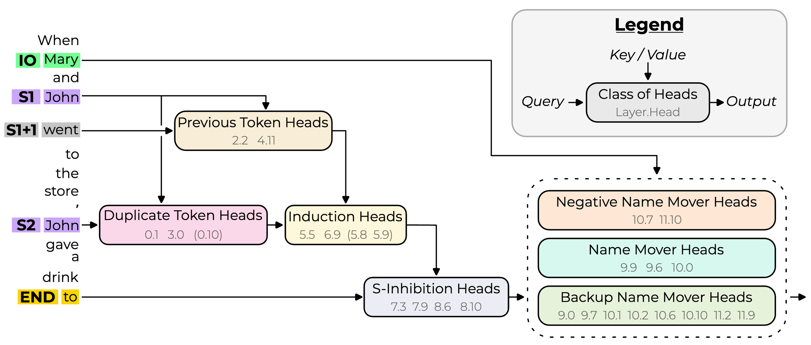
<center> _Image from: [Wang et al. (2022)](https://arxiv.org/abs/2211.00593)_</center>

The circuit is specified as a graph of important attention heads (nodes) and the interactions between them (edges) as applied to a specific sequence of tokens. The authors report that the circuit explains **87%** of the logit difference between the two name tokens. They find this number by passing some inputs to the model and ablating all activations outside of the circuit. Then they measure how much of the logit difference between the correct and incorrect name logits remains.

However, an important detail is that they arrived at this number by ablating the _nodes_ (heads) outside of the circuit, not by ablating the _edges_ (interactions between heads) outside of the circuit. So they don't ablate, for example, the edges from the previous token heads to the name mover heads, even though these are not part of the circuit (effectively including more edges in the circuit). We calculate the logit difference recovered (defined below) when we ablate the _edges_ outside of the circuit instead.

They ablate the heads by replacing their activations with the **mean** value calculated over the "ABC distribution", in which the names in the prompts are replaced by random names.In our experiments, we also try **resampling** the activations from different prompts (taking individual prompt activations instead of averaging).

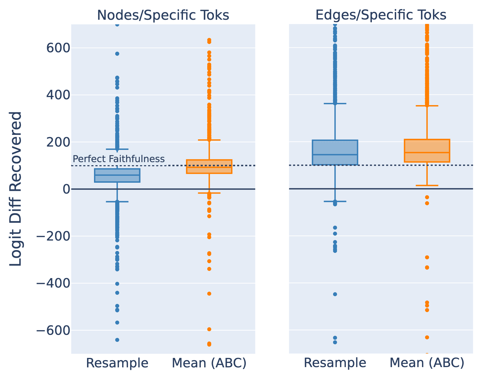

<center> _[IOI] Logit difference recovered (%) with **resample** and **mean** ablations (100% is best)_

1. *Nodes/Specific Toks = Ablate nodes not in the circuit (at relevant token positions).*
2. *Edges/Specific Toks = Ablate edges not in the circuit (at relevant token positions).*</center>

The first thing that jumps out from the box plots above is the very large range of results from different prompts. The charts here are cut off and some points are over 10,000%. This means that although the _average_ logit difference recovered is reasonable, few prompts actually have a logit difference recovered close to 100%.

And we see that ablating the edges instead of the nodes gives a much higher average logit difference recovered - close to 150% (which means that the isolated circuit has a greater logit difference between the correct and incorrect names than the un-ablated model). So the edge-based circuit they specified it is much less faithful than the node-based circuit they tested.

The authors calculate the 87% result as the ratio of the expected difference (over a set of prompts) in the ablated output and the expected difference in the normal output [left side of figure below]:

$$\text{Logit Difference Recovered} = \frac{\mathbb{E}[F(x)_{\text{correct}} - F(x)_{\text{incorrect}}]}{\mathbb{E}[M(x)_{\text{correct}} - M(x)_{\text{incorrect}}]} \times 100.$$

Where $M(x)_\text{correct}$ is the output logit for the correct name token when running the un‑ablated model on input $x$ and $F(x)_{\text{correct}}$ is the output logit for the correct name token when running the model on input $x$ and ablating all activations outside of circuit $C$ with values $A$ (similarly for _incorrect_, with the incorrect answer being the wrong person's name). But the more natural metric would be the _expected ratio_ of the difference in the ablated output and the difference in the normal output [right side of figure below].

$$\mathbb{E}\left[\frac{F(x)_{\text{correct}} - F(x)_{\text{incorrect}}}{M(x)_{\text{correct}} - M(x)_{\text{incorrect}}} \times 100 \right]$$

Which gives a substantially different result.

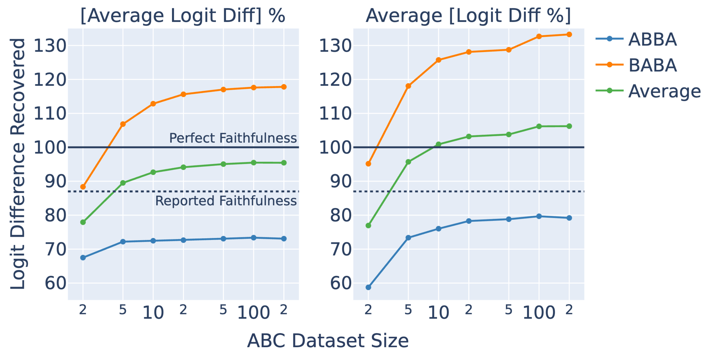

<center> _[IOI] Logit difference recovered (%) for the ABBA and BABA input distributions using different size ABC datasets to calculate the **mean** ablation. We also vary the method by which we average over datapoints. We ablate nodes not in the circuit (at relevant token positions) - this is how faithfulness is measured in the IOI paper._</center>

The authors combine two variations of the prompt format in their dataset that have different orderings of the names (ABBA or BABA). We separate these groups and find that BABA prompts score systemically higher.

Finally, we find that the faithfulness scores increase as we increase the number of samples used to calculate the mean ablations (ABC Dataset Size in the figure above). We need a surprisingly small dataset size (about 4 prompts) to reproduce the 87% figure reported.[[5]](#fn4hmcbbeh90f) Our hypothesis is that the noisy means calculated over a small number of points push the model towards particular wrong answers, whereas the less noisy means merely destroy all the information present (as intended).

### Docstring Circuit

The [docstring circuit](https://www.alignmentforum.org/posts/u6KXXmKFbXfWzoAXn/a-circuit-for-python-docstrings-in-a-4-layer-attention-only) is a circuit in a tiny 2-layer, attention-only transformer that computes completions to prompts of the form:

```python
def item(self, string, server, node, test, file, first):
	"""profit support street
	
	:param node: hat connection
	:param test: tip president
	:param 
```

Where the correct next token is `file`. The circuit looks like this:

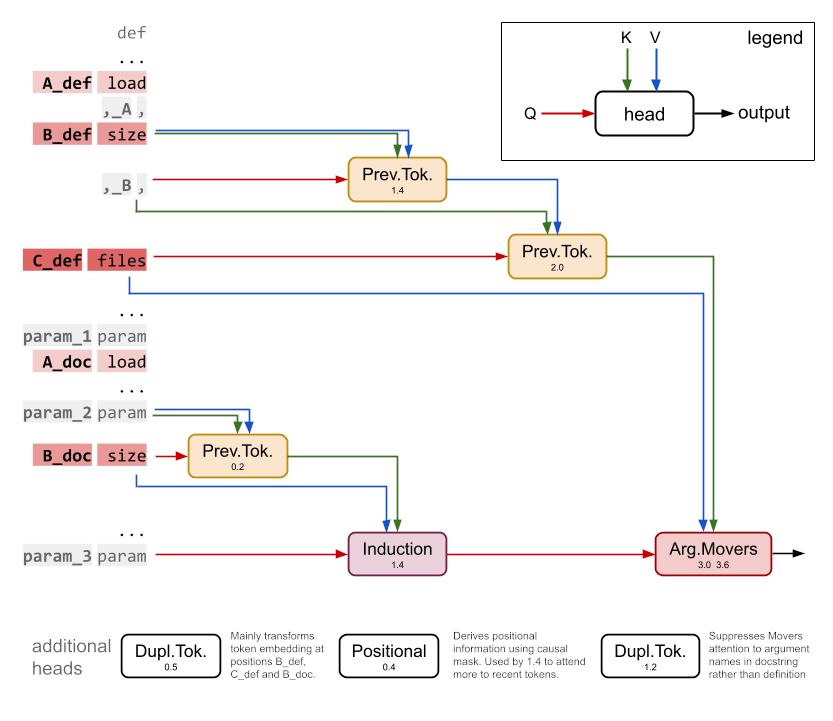

<center>_Image from: [Heimersheim and Janiak (2023)](https://www.alignmentforum.org/posts/u6KXXmKFbXfWzoAXn/a-circuit-for-python-docstrings-in-a-4-layer-attention-only)_</center>

The authors measure the faithfulness as the percentage of prompts where the highest logit is the correct answer and get a result of 58% (compared to the full model at 56%). As with the IOI circuit, they arrived at this number by **resampling** the activations of attention heads outside of the circuit, not by ablating the edges outside of the circuit. When we instead ablate the _edges_, we find a very different result.

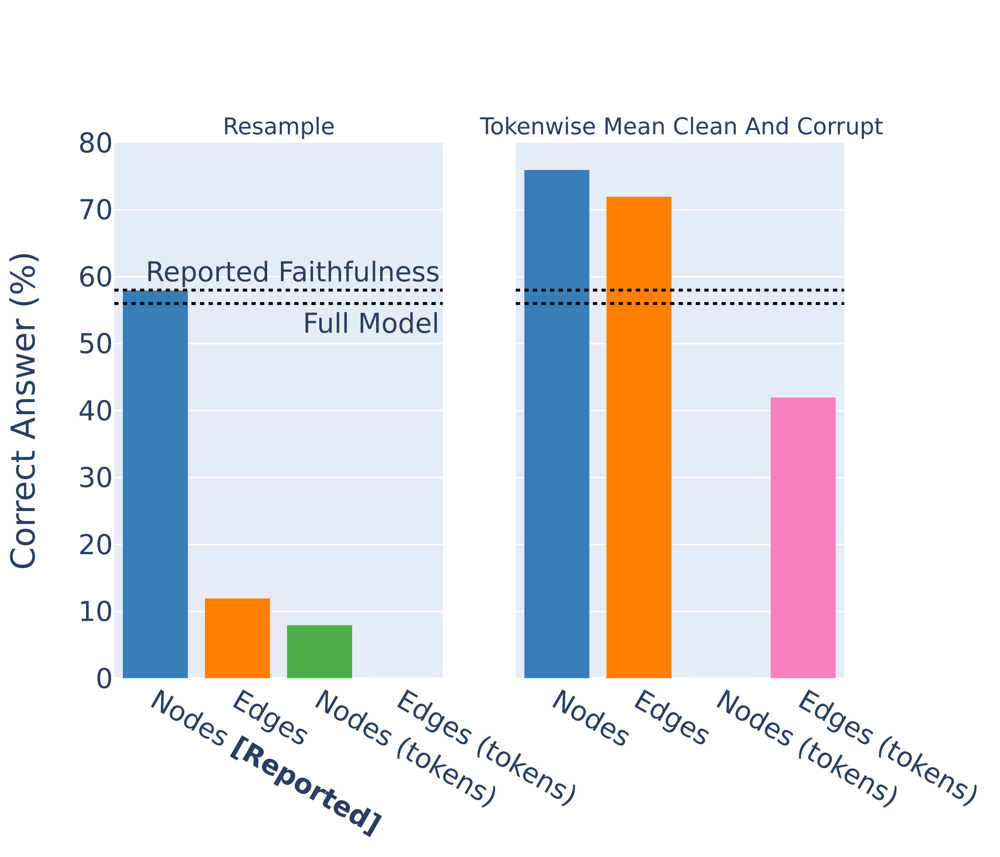

<center>_[Docstring] Percentage of correct top-1 outputs with **resample** and **mean** ablations (mean computed over clean and corrupt prompts)._</center>

1. *Nodes = Ablate nodes outside of the circuit.*
2. *Nodes (tokens)	 = Ablate nodes outside the circuit  (at relevant token positions).*
3. *Edges = Ablate edges outside of the circuit.*
4. *Edges (tokens) = Ablate edges outside the circuit  (at relevant token positions).*

The authors also don't distinguish between tokens in their ablations, even though the circuit specifies particular token positions for each edge. When we make this distinction the faithfulness metric drops dramatically. Finally, we try the experiments using **mean** ablations, instead of resampling activations from different prompts. This dramatically increases the faithfulness scores of the edge-level circuit.

Finally we note that, as with the IOI circuit, there is lots of variation between individual inputs for all ablation methodologies.

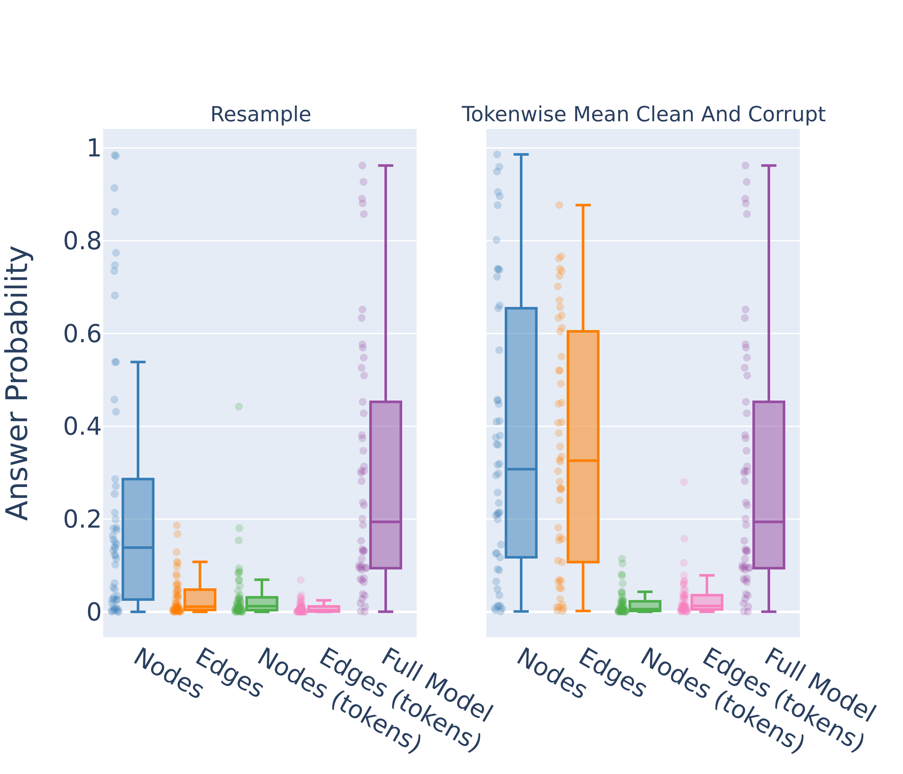

<center>*[Docstring] Probability of correct answer with **resample** and **mean** ablations (mean computed per token over clean and corrupt prompts).* </center>
*1. Nodes = Ablate nodes outside of the circuit*  
*2. Edges = Ablate edges outside of the circuit*  
*3. Nodes (tokens) = Ablate nodes outside the circuit  (at relevant token positions).*  
*4. Edges (tokens) = Ablate edges outside the circuit  (at relevant token positions).*

### Sports Players Circuit

[Nanda et al.](https://www.alignmentforum.org/posts/iGuwZTHWb6DFY3sKB/fact-finding-attempting-to-reverse-engineer-factual-recall) find a circuit in Pythia 2.8B that can correctly distinguish the sport played by famous sports players. Their metric is the percentage of prompts for which the correct sport token is the highest logit out of the three possible sports.

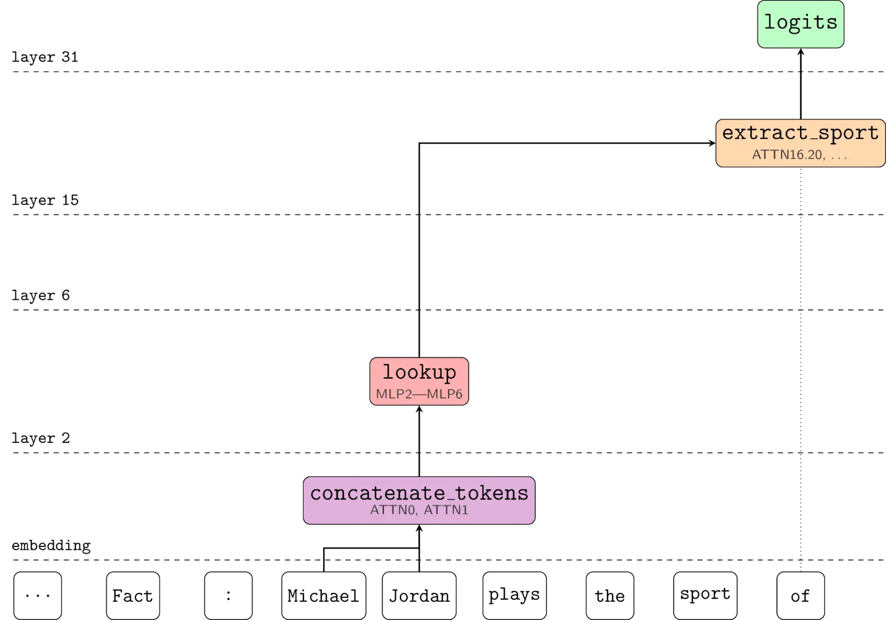

<center>_Image from: [Nanda et al. (2023)](https://www.alignmentforum.org/posts/iGuwZTHWb6DFY3sKB/fact-finding-attempting-to-reverse-engineer-factual-recall)_</center>

They test their circuit by **mean** ablating the edges outside of the circuit. When we use **resample** ablations instead, the metric goes to zero. This case is a little different because their aim wasn't to find the full circuit but to identify the place in the model where factual recall occurs, so this result doesn't negate their hypothesis. But it does again highlight the sensitivity of faithfulness scores to these nuanced choices in methodology

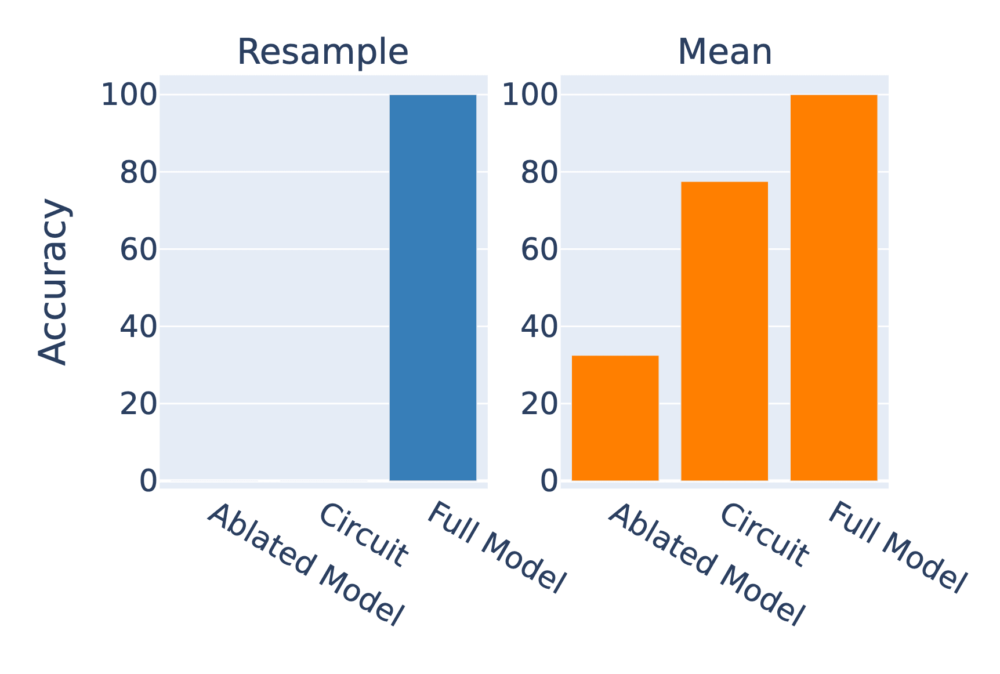

<center> _[Sports Players] The percentage of prompts for which the correct sport has the highest output logit with **mean** and **resample** ablations._ </center>

1. *Ablated Model = Ablate all activations*  
2. *Circuit = Ablate all activation except those in the circuit*
3. *Full model = No ablations*

## Methodology Should Match the Circuit

We conclude that if a circuit is specified as a set of edges, it should be tested using edge ablations. And if it is specified at a chosen set of token positions it should be tested with these.

But in other aspects there often isn't a clearly correct methodology. For example, it's unclear whether mean ablations are better than resample ablations for a particular experiment - even though this choice can dramatically change the outcome.

## Optimal Circuits are Defined by Ablation Methodology

We argue that because faithfulness metrics are sensitive to experimental methodology, it actually does not make sense to ask what the optimal circuit for a set of prompts is. The task is defined in part by the ablation methodology - you have to specify how you will **isolate** the circuit.

Do you want your IOI circuit to include the mechanism that decides it needs to output a name? Then use zero ablations. Or do you want to find the circuit that, given the context of outputting a name, completes the IOI task? Then use mean ablations. The ablation determines the task.

As a concrete example where this insight was overlooked, we review [Conmy et al.'s](https://arxiv.org/abs/2304.14997) experiments using automatic circuit discovery on two [Tracr](https://arxiv.org/abs/2301.05062) models. These are tiny transformers where the weights have been compiled to exactly implement some program - so we fully understand all of the internal components.

The authors choose "ground-truth" circuits as the edges required to recover full performance with **zero** ablations. But their circuit discovery algorithms use **resample** ablations to discover the circuit. Some of the information required to perform the task occurs in all of the inputs, so resampling activations doesn't disrupt the flow of this information. Whereas zero ablating does destroy the flow, requiring more edges to be included in the circuit.

Furthermore, two of their algorithms, SP and HISP, ablate _nodes_ to discover the circuits, but they specify the circuits in terms of _edges_. They report fairly weak results for all three algorithms. But when we redefine the "ground-truth" circuits as the edges required to recover performance with **resample** ablations and adjust SP and HISP to use _edge_ ablations to discover the circuit, we find that all three algorithms perfectly recover the "ground-truth".

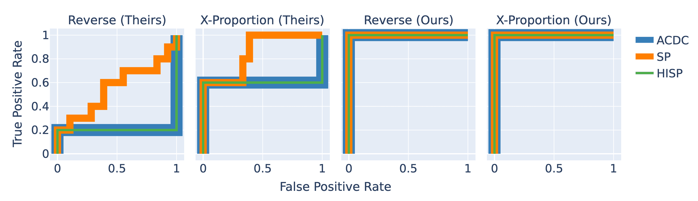

<center>*[Tracr Reverse and Tracr X-Proportion] Conmy et al. define the "ground-truth" circuit as those edges required to recover performance with **zero** ablation. But their circuit discovery algorithms are tuned to find the edges (or nodes in the case of SP and HISP) required to recover performance with **resample** ablations. When we adjust the circuit discovery algorithms to search for the edges required to recover performance with **resample** ablations, we find that all three algorithms have perfect performance.*</>

This example demonstrates the point that the correct circuit for a prompt alone is undefined. The method by which the circuit is isolated is crucial in determining the optimal set of components. When the ablation methodology for the circuit discovery algorithm and the "ground-truth" circuit are mismatched, the algorithm underperforms.

This is particularly important because circuit discovery algorithms are often tested by their ability to recover "ground-truth" circuits from the literature (eg, [[1](https://arxiv.org/abs/2304.14997)], [[2](https://arxiv.org/abs/2310.10348)], [[3](https://arxiv.org/abs/2406.16778)]) - without considering whether the circuit matches the algorithm.

## AutoCircuit

We release a [Python library called AutoCircuit](https://ufo-101.github.io/auto-circuit/) with the paper that implements edge ablation and circuit discovery highly efficiently. A previous [post explains the algorithm](https://www.lesswrong.com/posts/caZ3yR5GnzbZe2yJ3/how-to-do-patching-fast) in detail, but the short version is that it is much faster than previous implementations.

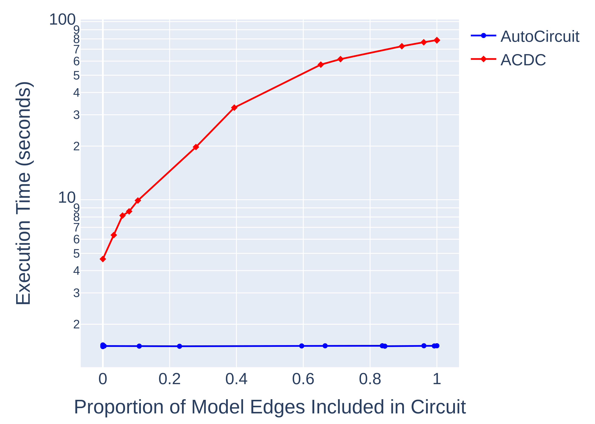

_Thanks to Arthur Conmy for his generous assistance in understanding and reproducing his work on Automatic Circuit Discovery and his insightful comments. Thanks to Adam Gleave, Lawrence Chan, Clement Neo, Alex Cloud, David Bau, Steven Bills, Sam Marks, Adrià Garriga-Alonso, Stefan Heimersheim, Nix Goldowsky-Dill and our anonymous reviewers at COLM 2024 for their invaluable feedback and suggestions. Thanks to Bryce Woodworth for his help and encouragement._