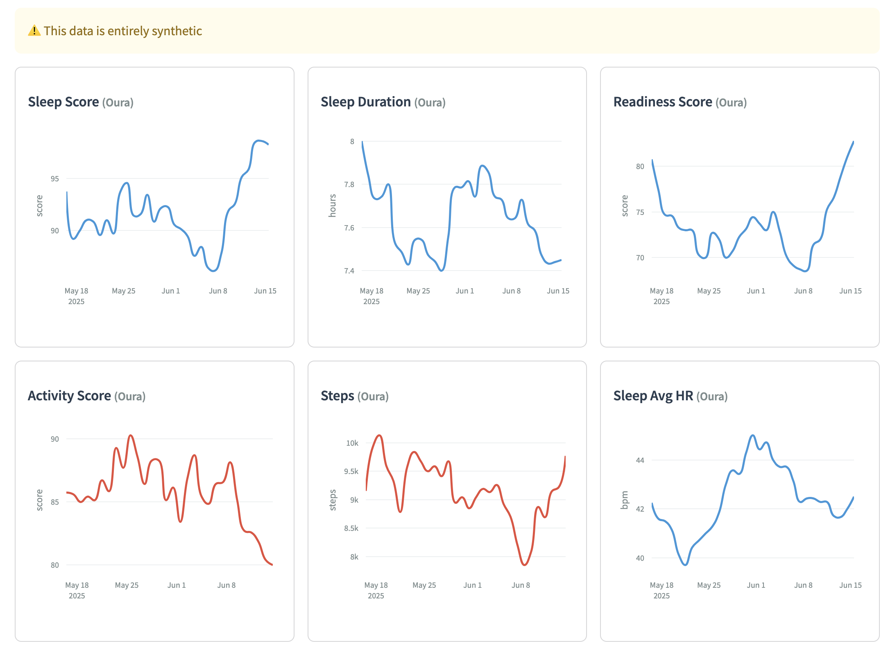
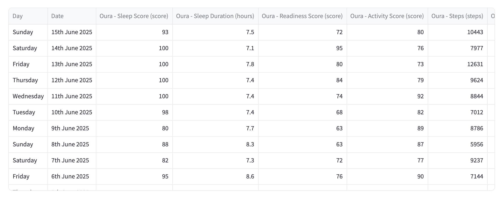
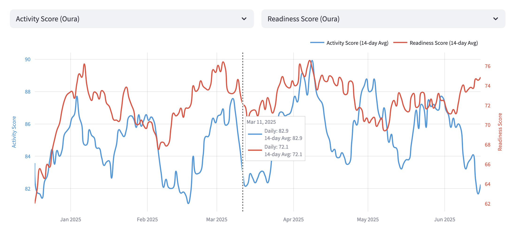
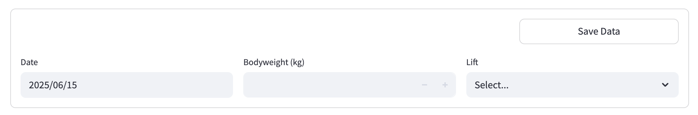

I use a bunch of different apps and wearables to track various health metrics. To name a few:

- [Cronometer](https://cronometer.com/#diary) for logging my nutrition.
- [Oura](https://ouraring.com/) for logging my sleep and recovery metrics.
- [Strava](https://www.strava.com/dashboard) / [Garmin](https://www.garmin.com/en-GB/) for logging my runs.
- A Google Sheet to log my bodyweight and days I lift.

I suspect as time goes on I'll continue to gradually accumulate health (and possibly other) data in various further services.

Having my data scattered across various different services was far from ideal.

- It meant having to check many different apps regularly to stay on top of things, which was so high friction it often meant I would just not.
- It meant having to learn to click through many different UIs to find the information I needed.
- It made spotting correlations and trends, especially across different services,  harder.
- It left me beholden to the data visualisation skill and taste of various app developers.

I wanted a single, consistent interface, over which I had complete control. I couldn't find an off the shelf software solution that fit my needs. I suspect none exists. The closest I found was [exist.io](https://exist.io/) but this lacked support for some of my data, and didn't seem as flexible and future proof as building my own solution.

 

---

 

So I built my own tool. It's pretty simple - it pings the APIs (or uses more cursed ways of backing data out from the less developer friendly apps...) of various services regularly, saves the data on S3, and has a frontend that can display the data in various ways. It's currently a little bit of a vibe coded mess and overfit to my use case but reach out if you're interested in using it / adding additional apps.

- Code here: [https://github.com/bilal-chughtai/health_dashboard](https://github.com/bilal-chughtai/health_dashboard).
- Frontend here: [https://bilals-health-dashboard-public.streamlit.app/](https://bilals-health-dashboard-public.streamlit.app/) (you might need to hit "wake me up" to restart the app).

 

---

 
Screenshots below. All of this data is fake, thanks Claude for generating surprisingly decent synthetic data here.

