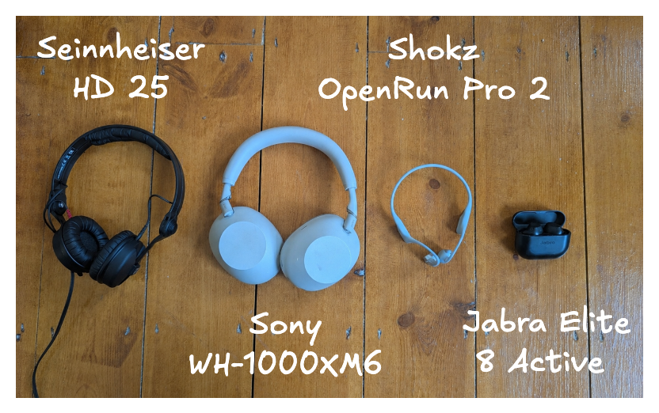

I lean minimalist. Everything I own must *pay rent*, in terms of storage space, mental clutter, faff in moving it whenever I next end up moving, etc. I pretty regularly realise some item I own isn't paying rent, and evict it.

As such, I was surprised to see that I had ended up with 4 different pairs of headphones. Here they are:

With more thought, it made sense. Each pair earns its slot by being best-in-class in some dimension that I care about. Here is a table justifying this claim:

| Type | Product | Bulk | Noise cancellation | Ability to hear surroundings | Audio latency | Use cases |
|------|---------|------|--------------------|------------------------------|---------------|-----------|
| In-ear, wireless | [Jabra Elite 8 Active](https://www.jabra.com/en-GB/supportpages/jabra-elite-8-active?sku=100-99160701-98) | **Low** | Medium | Medium | High | Out without a bag (low bulk means easy to stuff in pocket); the gym (low bulk means low sweat). |
| Over-ear, wireless | [Sony WH-1000XM6](https://www.sony.co.uk/headphones/products/wh-1000xm6) | High | **High** | Medium | High | Loud offices, loud flights (high noise cancellation). |
| Open-ear, bone conduction, wireless | [Shokz OpenRun Pro 2](https://uk.shokz.com/products/openrun-pro2?variant=50009478037837) | Medium | Low | **High** | High | Running on roads, cycling (high ability to hear surroundings). |
| On-ear, wired | [Sennheiser HD 25](https://www.sennheiser.com/en-us/catalog/products/headphones/hd-25/hd-25-506909) | High | Medium | Low | **Low** | DJing (low audio latency is important for beat matching). |
