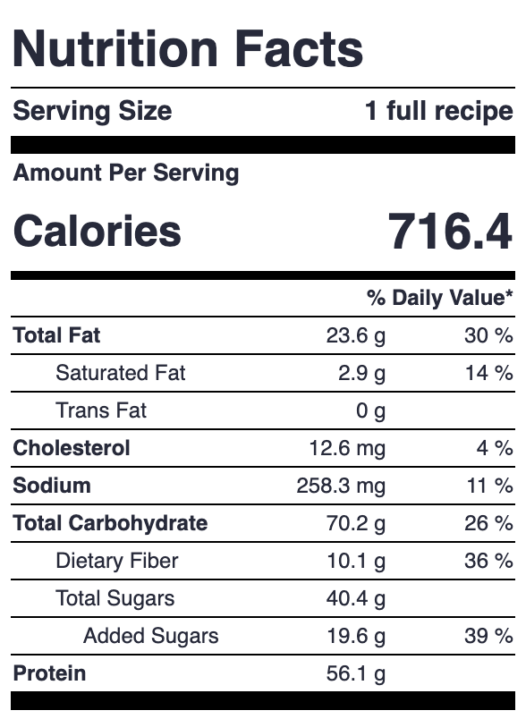
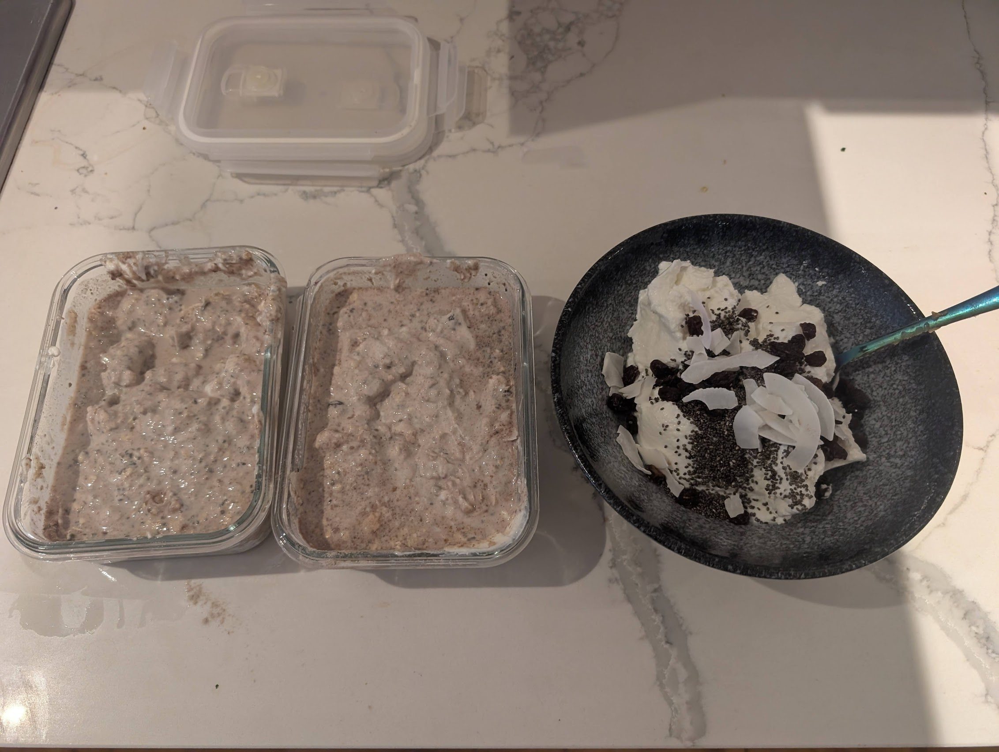
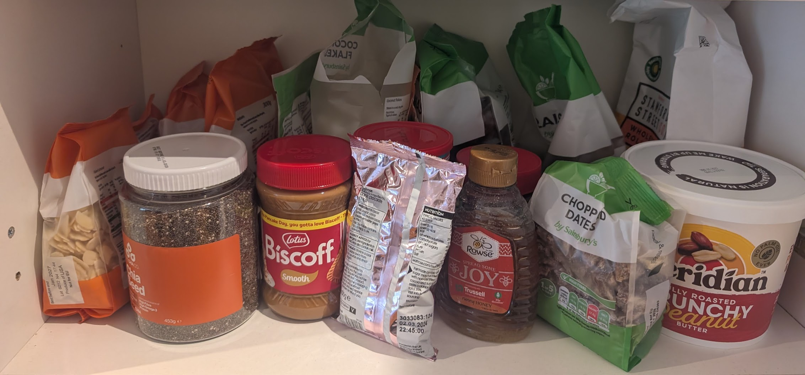

# My overnight oat protocol

I've recently been very obsessed with overnight oats. I eat them on average 3-4 times a week. You should consider trying them too.

# 1. Why care?

Here are a bunch of reasons to like overnight oats:

- They taste good.
- They have amazing macros (my recipe contains 56g of protein).
- They are very filling.
- They are low effort to prepare.
- They can be made in batch.
- They last in the fridge for ages (about a week).
- The toppings can be swapped out for novelty / need.
- They "feel healthy" (perhaps as it's all un/minimally-processed food?).

# 2. How to overnight oat.

My recipe consists of a fixed base, with some more flexible components.

**Base:**

- 6 tbsp (30g) rolled oats.
- 237.5g (1/4 of the 950g tub) of fage 0% greek yoghurt.
- 250ml (1 cup) skimmed milk.
- 15g (1/2 scoop) protein powder.
- 1 tbsp chia seeds.
- 1 tbsp peanut (or other nut) butter.
- 5g creatine.

**Flexible components:**

- 1-2 tbsp of some nut (cashew / walnut / almond / hazelnut / coconut flakes). These both taste good and add some texture.
- 1-2 tbsp of something sweet (dark chocolate chips / honey / nutella / biscoff / chopped dates / raisins / sultanas / dried apricots).
- Occasionally another flavouring (cinnamon / cocoa powder / instant coffee).
- A banana if I want more calories.

This comes out to something like the following macros:

# 3. Advice.

You should eventually prepare in batch as time to prepare is sub-linear in number of batches, but initially it's [probably better](https://www.lesswrong.com/posts/NytNporGkzzvyxJZC/aim-for-single-piece-flow) to just make one batch at a time, while you're figuring out what you like. My usual protocol is to make two batches of overnight oats alongside one batch of yoghurt on-its-own to consume imminently, using up an entire 950g pot of fage. 

I recommend going out and buying everything you might possibly want to put in overnight oats and experimenting with flavour combinations. I have an entire shelf dedicated to my overnight oat operation in my kitchen.

*Thanks to Sahil for putting me on.*
