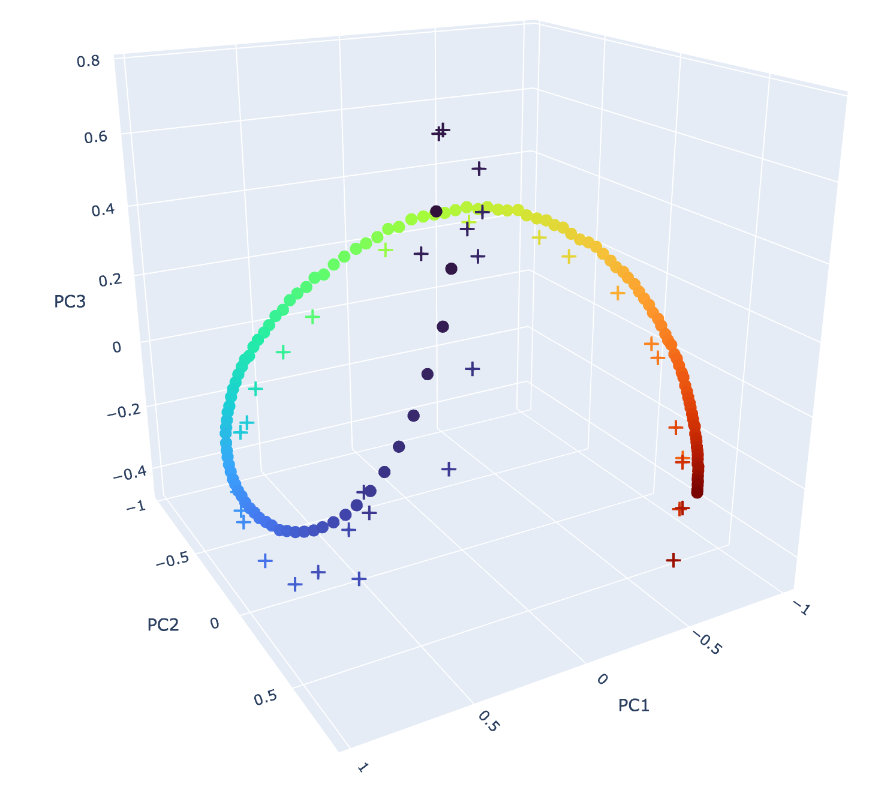
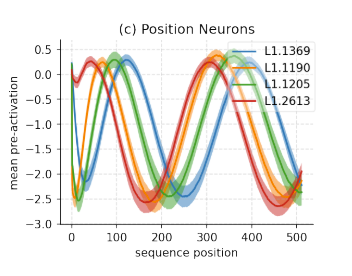
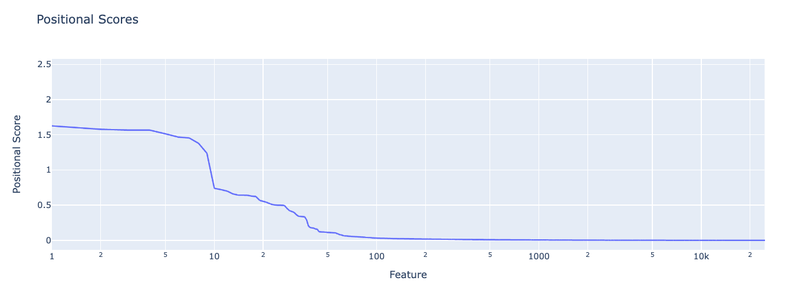
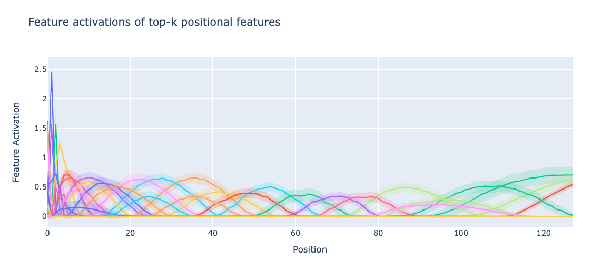
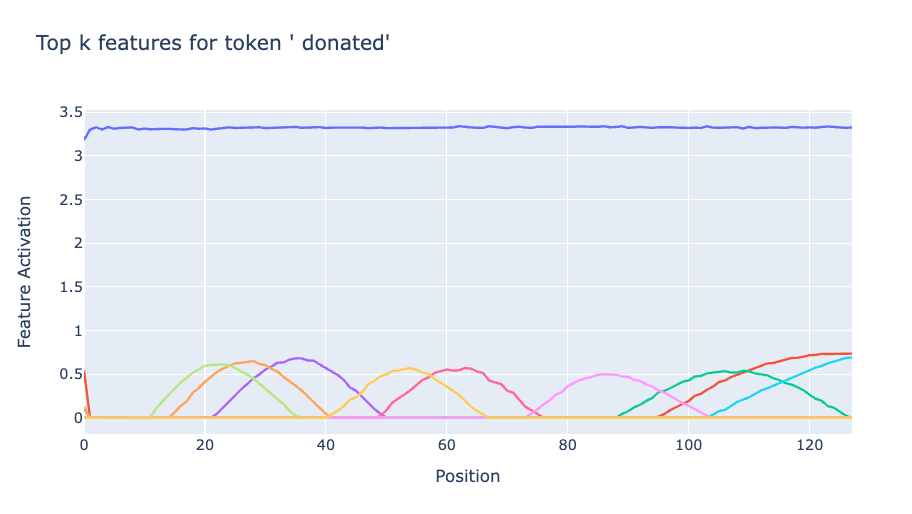
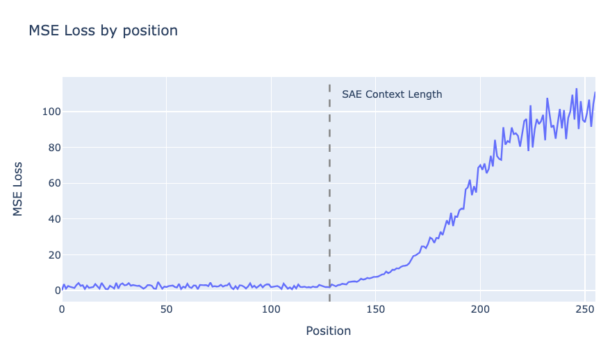
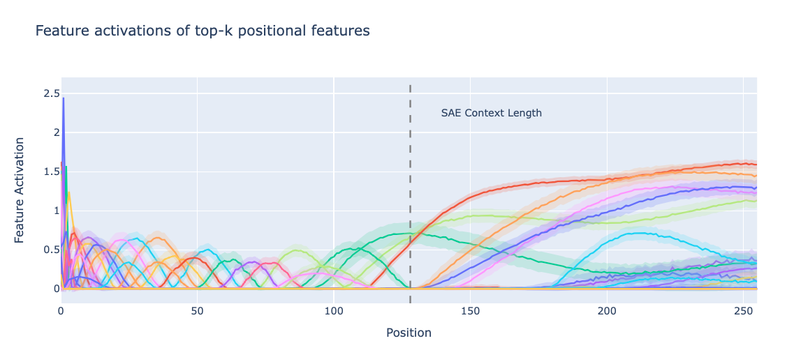
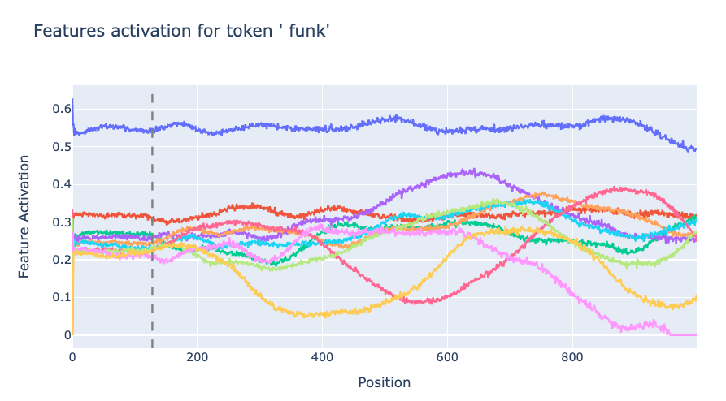
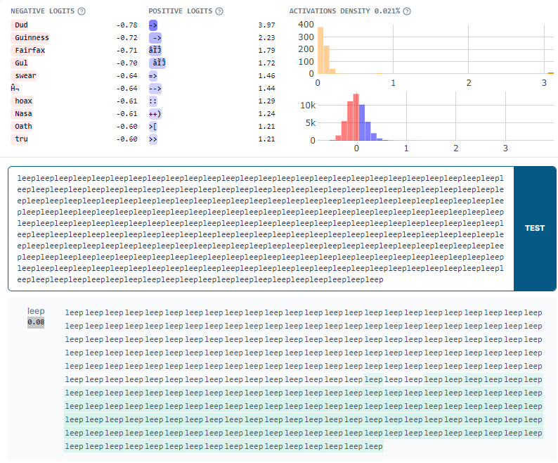

# Write Up

_This is an informal research note. It is the result of a few-day exploration into positional SAE features conducted as part of Neel Nanda’s training phase of the ML Alignment & Theory Scholars Program - Summer 2024 cohort._

## Summary

Figure 1: **(Dots)** The top 3 PCA components of rows 1 to 127 of gpt2-small’s positional embedding matrix explain 95% of their variance. **(Crosses)** SAEs trained on layer 0 residual stream activations learn many features that together recover this 1 dimensional helical manifold. Colour corresponds to the position on which the feature is most active. Blue corresponds to position 1, red corresponds to position 127. The position 0 row and SAE features are omitted (as they are weird).

We investigate _positional SAE features_ learned by layer 0 residual stream SAEs trained on gpt2-small. In particular, we study the activation `blocks.0.hook_resid_pre`, which is the sum of the token embeddings and positional embeddings. Importantly gpt2-small uses absolute learned positional embeddings – that is, the positional embeddings are a trainable parameter (learned) and are injected into the residual stream (absolute).

We find that this SAE learns a set of _positional features_. We investigate some of the properties of these features, finding

- _Positional_ and _semantic_ features are (almost) entirely disjoint at layer 0.  Note that we do not expect this to continue holding in later layers as attention mixes semantic and positional information. In layer 0, we should _expect_ the SAE to disentangle positional and semantic features as there is a natural notion of ground truth positional and semantic features that interact purely additively. 
- Generically, each positional feature spans a range of positions, except for the first few positions which each get dedicated (and sometimes, several) features.
- We can attribute [degradation](https://www.lesswrong.com/posts/f9EgfLSurAiqRJySD/open-source-sparse-autoencoders-for-all-residual-stream?commentId=5d5eKJJrDkwzQbKgf) of SAE performance beyond the SAE training context length to (lack of) these positional features, and to the absolute nature of positional embeddings used by this model.

## Set Up

We study pretrained gpt2-small SAEs trained on `blocks.0.hook_resid_pre`. This is particularly clean, as we can generate the entire input distribution to the SAE by summing each of the `d_vocab` token embeddings with each of the `n_ctx` positional embeddings, obtaining a tensor

`all_resid_pres: Float[Tensor, “d_vocab n_ctx d_model”]` 

By passing this tensor through the SAE, we can grab all of the pre/post activation function feature activations

`all_feature_acts: Float[Tensor, “d_vocab n_ctx d_sae”]`

In this post, `d_model = 768` and `d_sae = 24576`. Importantly the SAE we study in this post has `context_size=128`. The SAE context size corresponds is the maximal length of input sequence used to generate activations for training of the SAE.

## Finding features

The activation space of study can be thought of as the direct sum of the token embedding space and the positional embedding space. As such, we hypothesize that semantic and positional features learned by the SAE should be distinct.

That is, we hypothesize that the feature activations for some feature i can be written in the form 

$f_i(x_{tok}+x_{pos})=g_i(x_{tok})+h_i(x_{pos})$

where for each $i$, either $g_i=0$ or $h_i=0$ identically for all inputs in their domain and $x$ is a `d_model` dimensional vector.

To investigate this we hold `tok` or `pos` fixed in `all_feature_acts` and vary the other input. We first restrict to `pos < sae.cfg.context_size`. 

### Positional features

We first replicate Figure 1f of [Gurnee et al. (2024)](https://arxiv.org/pdf/2401.12181), which finds instances of sinusoidal positional _neurons_ in MLP layers.

To do so, we assign each feature a _positional score_. We first compute the mean activation of each feature at each position by averaging over all possible input tokens. The position score is the max value of this over all positions, i.e.

$p_i=\max_{pos}\{\text{mean}_{tok}{f_i(tok,pos)}\}$

where $f_i(tok,pos)$ is the feature activation for feature i for the given input. 

We find positional scores drop off rapidly. There seem to only be ~50 positional features (of 24k total features) in this SAE. 

Inspecting the features, we find

1. Many positional features, each with small standard deviation over input tokens (shown in lower opacity below, indicating they really are true positional features). These span the entire context length.
2. The pre-ReLU feature activations are close to sinusoidal, but only rise above zero (so survive the ReLU) once in the context length of the SAE, so correspond to a _localised range_ of token positions.
3. Early positions fire more strongly than later positional features, and there seem to be many more of them. Our metric gives them higher positional scores than other positional features.
4. All positions get some positional features, but later positions are forced to share their features across several positions, while early positions get proportionally more dedicated features. In Figure 1, we see that the the ground truth positional embeddings are more spread out for early positions, so this is to be expected.

We directly compare the learned feature directions to the W_pos matrix in Figure 1, by plotting the position of the peak of each positional feature bump.

### Semantic features

Semantic features are relatively well studied, so we only briefly study them here. In particular, we can find the most important features for a given token by assigning _token scores_ for each feature for a particular token by instead taking the mean over all _positions_. Below we plot the top-k features for a particular token. We generally find that for a fixed token there are some strong/weakly activating token dependent features (horizontal lines), and a set of lower magnitude position dependent features (bumps) that fire conditional on the sequence position.

## Length generalization of SAEs

It has [been](https://www.lesswrong.com/posts/f9EgfLSurAiqRJySD/open-source-sparse-autoencoders-for-all-residual-stream?commentId=5d5eKJJrDkwzQbKgf) [observed](https://www.lesswrong.com/posts/8QRH8wKcnKGhpAu2o/examining-language-model-performance-with-reconstructed#How_does_context_length_affect_SAE_performance_on_randomly_sampled_data_) that SAEs sometimes break out of the training context length of activations they were trained on. In particular, the reconstruction error blows up. Note that the reconstruction error is significantly worse than what one would obtain by randomly reconstructing a vector of similar norm.

Why does this happen? We provide several lines of evidence.

### Positional features break

We now extend the plot of feature activations of positional features to positions beyond the context length. Things get pretty weird….

Positional features are trained on short contexts, and overfit to them. This plot suggests that at late positions the SAE “thinks” that it is at significantly earlier positions, as each feature in the training distribution only corresponds to a highly local region.

### Semantic features break

Semantic features _also_ break. The features which fire for given tokens have stable activations until the end of the SAE context length, but then become noisier.

Additionally, features that did not fire for small positions also suddenly start firing as the position is increased. _The SAE thinks tokens are present which are not_**.** We can easily validate this in [neuronpedia](https://www.neuronpedia.org/). Here’s a feature that “should” fire on arrows (e.g. “->”). However, it It also fires on the word “leep” late in the context, making the SAE "think" there are arrows present.

## Discussion

**Why does the SAE not learn one feature for each position?** As we can see in Figure 1 and Figure 3, The SAE learns fewer positional features than positions. Features mostly correspond to a range of positions. This shouldn’t be surprising – we see in Figure 1 that the cosine sim of adjacent positions is very high. The SAE sparsity penalty penalises learning highly similar features. We suspect training SAEs to recover positional encodings might be a good toy set up for studying _feature splitting_, and predict the number of positional features should behave predictably under scaling SAE width.

**Thoughts on SAE feature geometry.** While it is possible to assign highly interpretable and accurate explanations to each positional SAE feature, such explanations lose sight of the rich feature geometry of the positional embedding. [The placement of each feature vector in the activation space matters](https://www.lesswrong.com/posts/MFBTjb2qf3ziWmzz6/sae-feature-geometry-is-outside-the-superposition-hypothesis#The_placement_of_each_feature_vector_in_the_activation_space_matters), and communicating the large, inscrutable `W_dec` matrix of the SAE (as we do in Figure 1) does not constitute an explanation. The SAE features present in circular temporal features found by [Engels et al.](https://arxiv.org/pdf/2405.14860) suffer a similar problem.

**What’s up with length generalization?** The SAE encoder attempts to disentangle features in superposition, assigning a coefficient to each feature despite there existing many other features "nearby". 

However, it has never seen `W_pos[128:]`. On top of not being able to reconstruct these positional features at all, it _also_ can’t minimize interference of `W_pos[128:]` with positional features for positions lower than the context length, or the token-like semantic features which it has already learned. What we are observing in the large reconstruction errors are these two separate types of error. This is pretty fundamentally broken. It’s possible that finetuning the SAE on a small amount of longer context activations would be sufficient for fixing this.

That said, we note that the length generalization results may not be all that important, as modern LLMs do not use absolute, learned positional embeddings. SAEs trained on Pythia, which uses [rotary embeddings](https://arxiv.org/abs/2104.09864), empirically [don’t seem to suffer the same problem](https://www.lesswrong.com/posts/f9EgfLSurAiqRJySD/open-source-sparse-autoencoders-for-all-residual-stream#5d5eKJJrDkwzQbKgf). Indeed, one of the primary motivations of rotary embeddings in the first place was to improve LLM length generalization.

## Acknowledgements

_Bilal and Yeu-Tong pair programmed on most of this work. Bilal wrote up this post. Thanks to Andy Arditi, Arthur Conmy and Stefan Heimersheim for helpful feedback. Thanks to Joseph Bloom for training this SAE._
