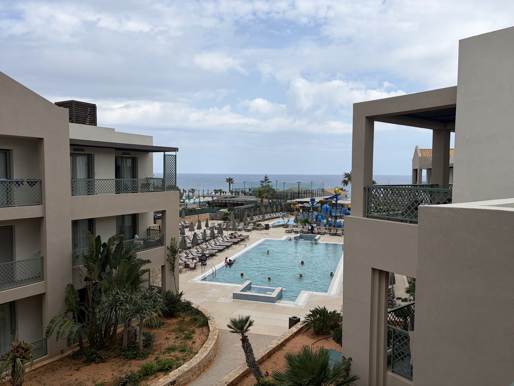

I used to think resort holidays were lame. I'd also never been on one, so held this view weakly. I recently helped organise and went on my first resort holiday for a friend's bachelor party. The experience updated me pretty positively on resorts; I now think they can be great in certain situations.

- My prior conception was that there was too little to do on a resort holiday and I would quickly get bored of laying on the beach and eating food. I think this is probably a fair assessment of some resorts, but it wasn't true of ours. The resort we went to had easily enough activities to fill the few days we spent there (it was a sport coded resort - think tennis, padel, beach volleyball, football, etc).
- I used to think that "relaxing" on holiday was soft, and that the right way to spend a holiday was to go very hard and to see or do lots of things. I've recently come around to the view that this is not the only valid type of holiday. I've generally become more into the idea of *rest*. My personality type is such that I always want to be optimising and trying to squeeze the most value out of every minute of my time, especially on holiday when my minutes are scarce. This mindset can result in being in a constant state of fatigue, so being forced to really switch off and relax can sometimes be helpful - resorts can really force this on you.
- I like planning and organising things. I used to think that part of the fun of a holiday is doing the ops work to figure out your own itinerary: booking your own flights, hotels, figuring out where to go and when, etc. As I've gotten older and busier I've started to appreciate more the extent to which this work trades off against other things I might want to spend my time doing. Reducing the work to 'pick some dates, book, go to the airport' for busy people can be a pretty big plus (one of the organisers of this trip also had a wedding to plan!). Conditional on being on a resort, I didn't feel like tons of value was lost by not planning each individual day ahead of time, as the option space on a resort is fairly constrained. Not having to think about food (as was the case on our all-inclusive resort) was also a plus. That said, I think a large part of the fun of planning is being able to find activities that really cater to your individual preferences, which is somewhat harder on a resort precisely due to the limited option space.
- For large groups especially, e.g. a large family, or in my case - a group of 12 guys on a stag do - reducing coordination costs is fantastic. Booking the holiday was about as easy as I think is possible given 12 people. Further, people have differing preferences, and an advantage of a resort is everyone is free to do what they want when they want. All activities being in the same physical place makes it very easy to jump in and out of them. Contrast this to a nature break (it's hard to bail early from a group hike, or to start the hike before everyone is ready), or a city break (it's hard to rejoin the group if you split off if you have to commute to get to where they are). This holiday worked notably better than other large group holidays I've been on before. Some specific ways I noticed a resort working better:
    - I know I am unusually grumpy on a poor night of sleep, and know that to get a good night of sleep I need to retire really quite early - I appreciated being able to do so very easily.
    - I was the only serious runner of the group, and wanted to squeeze in a few runs outside of the resort; I appreciated being able to drop out to run and drop back in easily after finishing my run.
    - My social battery is somewhat lower than median - I appreciated being able to dip and go and read my book to recharge for 30 minutes before jumping back in to the group activity.

I previously would have rolled my eyes at a suggestion to go to a resort. Now I'd actively recommend it for the right occasion and group. Specifically, I think resorts can be great for large groups, when organisation bandwidth is limited, and when rest is the goal.

*Thanks to Sahil for getting engaged and dragging us all on this bachelor trip. I had a lot of fun — probably my favourite trip in a long time.*
