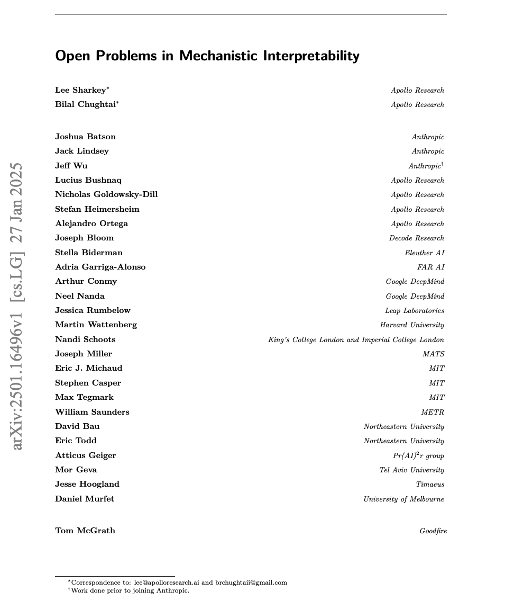
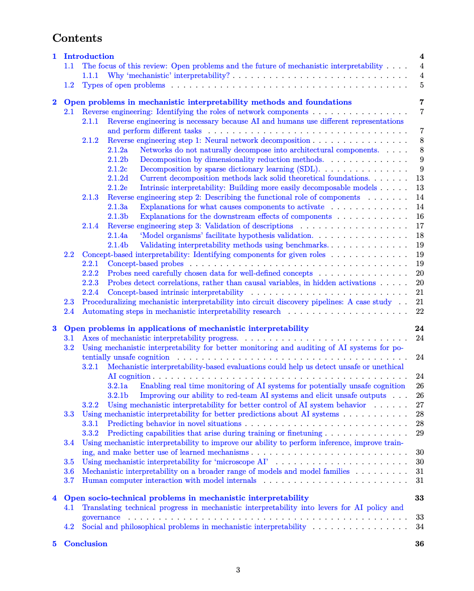

Full paper [here](https://arxiv.org/abs/2501.16496).

**TL;DR: This paper brings together ~30 mechanistic interpretability researchers from 18 different research orgs to review current progress and the main open problems of the field.**

_This review collects the perspectives of its various authors and represents a synthesis of their views by Apollo Research on behalf of Schmidt Sciences. The perspectives presented here do not necessarily reflect the views of any individual author or the institutions with which they are affiliated._

# Abstract

Mechanistic interpretability aims to understand the computational mechanisms underlying neural networks’ capabilities in order to accomplish concrete scientific and engineering goals. 

Progress in this field thus promises to provide greater assurance over AI system behavior and shed light on exciting scientific questions about the nature of intelligence. 

Despite recent progress toward these goals, there are many open problems in the field that require solutions before many scientific and practical benefits can be realized: 

Our methods require both conceptual and practical improvements to reveal deeper insights; we must figure out how best to apply our methods in pursuit of specific goals; and the field must grapple with socio-technical challenges that influence and are influenced by our work. 

This forward-facing review discusses the current frontier of mechanistic interpretability and the open problems that the field may benefit from prioritizing.

# Contents

