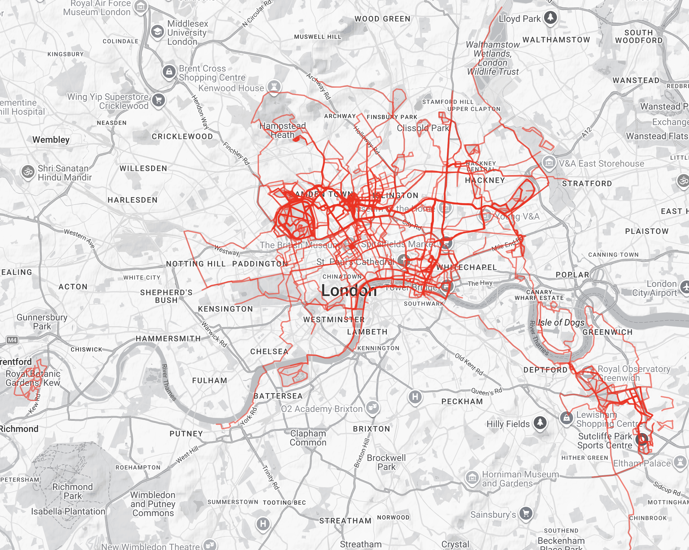
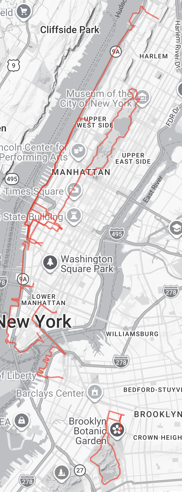
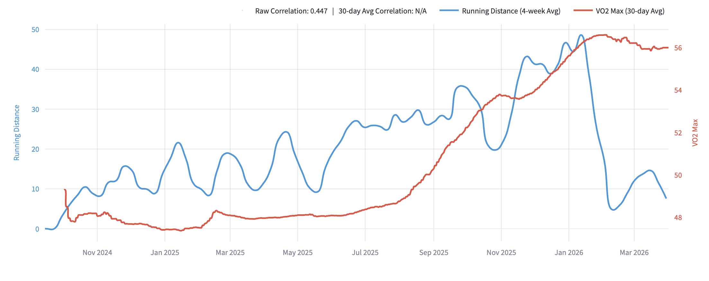
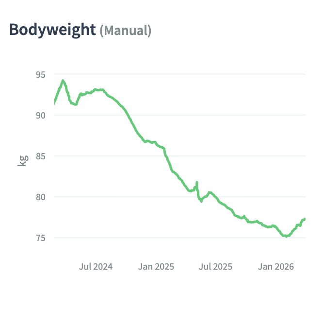

# Becoming a runner

I've not always been a runner. I distinctly remember being so bad at running as a child that I would get lapped in 800m track races at school by the fastest kids. I'm now a decent runner (here are my [qualifications](https://bilalchughtai.co.uk/races/)). Getting into running has been one of the best decisions I've made in the past year, and running is now one of my all time favourite obsessions. Here are some lessons from the road. I expect people who either want to get in to running or are currently in the process of doing so might benefit most from this post.

## 1. Why run?

Here are some reasons I run.

**Meaning.** I personally get a lot of meaning from the process of improving and optimizing things. Running (much like my previous sport of choice - powerlifting), is pretty amenable to optimization, so is highly appealing to people with a personality like mine. There are great proxy metrics of success (e.g. estimates of VO2-max, 5k time), which are cheap to measure and correlate well with the actual thing you care about. These and other progress metrics give you great feedback loops that tell you whether what you're doing is working or not.

**Health**. Beyond direct health effects from the activity itself, I think running gets some credit for other ways in which I try to be healthy. Because I care quite a lot about improving at running, this forces me to care about my recovery; I should be eating well and I should be sleeping well to elicit maximal running performance. Having a reasonable body composition is also incentivised by running, and a dimension I've made a bunch of progress on simultaneously getting into running, in part directly motivated by running performance.

**Exploration.** A thing I didn't predict ahead of time is that running is fantastic for exploring, which is a pretty strong benefit if you value novelty as much as I do. Despite living in London for basically my entire life, I've probably seen more of London by foot over the past year through running than in the previous 24 years combined. Here is a [heatmap](https://www.statshunters.com/heatmap#c=51.509597,-0.064201&z=12) of all my London running.

Running is also a great way to explore new places - when I travel to some new place, one thing I always look forward to is exploring via running. I was in NYC for 2 weeks last September, and saw a lot of the city through my running.

**Utility.** I used to not be very cardiovascularly fit. I didn't use to back myself to run if my life depended on it. I wouldn't even run to catch a bus, both because I wasn't comfortable running, so wasn't calibrated on how hard I could run, and because I would reliably end up a sweaty, wheezing mess by the end of it. I now regularly run places for utility -- I'll run 100m to catch a bus, I'll run around my office to be on time for a meeting and I'll sometimes even run several kilometres in regular clothes just to get places.

**Carry over to other non running activities.** I am much more able to do and enjoy non-running things that utilize my body than I used to. I expect hiking would be far less fun if I were less fit. Here is a photo of me from a recent Dolomites trip:

**Mood**. Exercise in general [seems to be great](https://www.bmj.com/content/384/bmj-2023-075847) for improving one's mood.

**Location invariance.** You can run literally anywhere. This is useful in normal life, but especially useful when away from home - my running doesn't have to take a hit if I'm away for a few days. Other forms of exercise might.

**Time efficiency.**  Running is pretty time efficient by default, you can get a reasonable workout in 30 minutes. This makes it easy to squeeze into a busy schedule. Not having to travel anywhere to run adds to the time efficiency. Other exercise generally is less time efficient.

**Solo.** Running is a sport that can be done solo. This reduces coordination cost. It also makes it easy to squeeze in around other things going on in my day. But running also *can* be social - I'll go on 1-2 runs with friends in an average week (of my 4 runs), and enjoy this balance.

## 2. Building a sustainable running habit

It took me 3 distinct attempts to get into running. Here are some things I learned in my first few months of my (successful) most recent attempt.

**Run slower.** Step zero to getting into running is to [RUN SLOWER](https://dynomight.net/2021/01/25/how-to-run-without-all-the-agonizing-pain/). I cannot emphasise this enough. New runners generally far too fast, reliably therefore suffer, and then fail to push through the willpower required to stick at it. The solution here is to run slower than you think is reasonable.

**Have a plan.** Have a program and stick to it. Know which days you'll run on, when in the day, and what run you'll do. Figure out what schedule works reliably for you. Having any program is better than having no program, so don't worry too much about what the "right" program is, and instead just find one you can stick to consistently. Most beginner programs will start you off with interleaving jogging and walking. The thing that eventually worked for me was a slower version of [Couch to 5k](https://www.nhs.uk/better-health/get-active/get-running-with-couch-to-5k/), where I repeated most of the later weeks to give my body more time to adjust. [Dynomight](https://dynomight.net/2021/01/25/how-to-run-without-all-the-agonizing-pain/) suggests something that practically looks initially quite similar.

**Wear the right shoes.** Not wearing the right shoes is a recipe for getting injured running. The right shoes should be your first running investment, but you'll probably be okay for a while as you won't be running lots if you're new. I find barefoot shoes comfortable, and had been walking around for years in them. I also knew barefoot running was a thing, so decided to just be a barefoot runner. This was going great, until it predictably didn't. During peak half marathon training this January, I managed to injure my plantar on my left foot. I couldn't run for a month, and had to take it easier than average for another month. I'm now, as of early April, back to near full intensity running, which is a pretty speedy plantar fasciitis recovery I'm told. Not wearing the right shoes while running a lot, especially on concrete, was an error. Don't be like me. Go to a running shop and defer to their judgement. I bought mine at [London City Runner](https://maps.app.goo.gl/hXav7njuNFznH3aJ6).

**Buy a running watch.** As a new runner, you both won't be very calibrated on what pace you are running, and also won't have that clear an idea of how long you can run at any particular pace. A running watch will train you in both of these skills, through showing you a live pace on your wrist. I use a [Garmin](https://www.garmin.com/en-GB/p/1611937/pn/010-02863-31/). Your existing smartwatch is probably sufficient if you have one.

## 3. Improving

Once you're running consistently, you can start thinking more carefully about improving.

**Milestones.** I worked my way through a series of milestones that often alternated between "distance" milestones and "speed" milestones. I usually didn't decide what my next milestone would be until after I achieved the previous. These milestones usually directly informed what program I would run. In order, these were:

- "feeling comfortable running 5k without stopping"
- sub 30 minute 5k
- "feeling comfortable running 10k without stopping"
- sub 60 minute 10k
- "feeling comfortable running a half marathon without stopping"
- ... at this point milestones like these felt to me less useful as a framing. I then moved on to a different race-first approach, that I'll discuss later.

**Programs.** Having a program at all I find pretty important to running consistently. I've tried a number of programs in my time. Couch to 5k is a pretty solid entry level running program that gets you comfortable running 5k consistently. It might still be a good place to start. But my mainline recommendation now is to sign up to **[Runna](https://www.runna.com/)**. Runna will create a personalised running program for you based on your level of experience and your current running goals. I expect it to be optimal for a pretty wide range of experience levels, from beginner all the way up to well past my current ability. Runna also has a beautiful UI experience. It syncs my scheduled runs to my Google calendar and to my Garmin, making it very easy for me to stick to it. Compared to other programs I've tried, the program is also a lot more interesting -- the runs change every single week.

**Volume.** Volume is so important. I got a lot out of just running consistently and pushing my running volume slowly up to about 50km/week. Speed and tempo work eventually also becomes important, but if you're a new runner and not improving - my number one recommendation would be to try and increase your weekly running volume in the first instance. Thanks to Cindy for hammering this point home with me. We can see below that once I started consistently running >25km a week, my garmin-estimated VO2 Max started very rapidly climbing.

This does require some prerequisite level of fitness - it's hard to push your volume to 50km/week if you struggle to run >10km consistently. Which is why I think something like my above milestone progression of increasing distances you feel comfortable running is pretty sensible for new runners.

**Races**. I personally find [races](https://bilalchughtai.co.uk/races/) very motivating. They act as a forcing function for me to stick to my program. They also give me something to look forward to and train for. I'll also often do the same race as a bunch of friends, providing some social accountability. These days, I'll usually run a race every 3 or so months, though only seriously peak for a "primary" race every 6 months, which is what I'll structure my training around. I'll also run a parkrun every month or so, sometimes choosing to go hard and 5k PB if I'm feeling fit and sufficiently recovered.

**Recovery.** Something to track as you're running more is whether your recovery is sufficient for your volume. This was another grave error made in my running career. I have been on a slow cut for a long time - it's been a constant over the past near 2 years of my life. I wasn't tracking the interaction effects of running and cutting very carefully. I sometimes noticed I was losing weight faster than I had intended, attributed this to running, so upped my calories (mostly via carbs) in response. But I wasn't forecasting higher caloric needs ahead of time very coherently. So when my volume during my half marathon training block crept up to 50km/week, I failed to adjust my intake, leading to some background level of severe exhaustion. On top of that, I had a busy day the day after a 21k training run, and forgot to eat a couple meals, so had a 1000 calorie day on top of some background level of fatigue, at which point my body decided it was being starved and shut down. I was brainfoggy for weeks, which spiralled into a quite extended period of lower than average mood. I've recently been eating in a bit of a surplus, as can be seen below, to combat this. Fuelling your running is important, especially if you're running high volumes. I won't be making this mistake again.

## 4. My future

**Further progression.** Once half marathon training runs become comfortable, the field opens up a bit. Further pushing distance is one direction one can go, pushing speed in shorter distances is another direction. In 2026 I've mostly chosen the speed direction. I've chosen to attempt to improve my 10k and half marathon times, as can be seen by the [races](https://bilalchughtai.co.uk/races/) I'm running. I'm also running 5k's pretty regularly. I mostly chose to do this after failing to run my intended first half in February due to an injury, and feeling like I really should run a half before training for a Marathon. I also was having some recovery problems with my peak half marathon training volume, and wasn't feeling that excited about pushing my volume further without giving my body more time to acclimatise to the current volume. I expect I'll run a Marathon in 2027, and after that decide where I want to go longer term.
