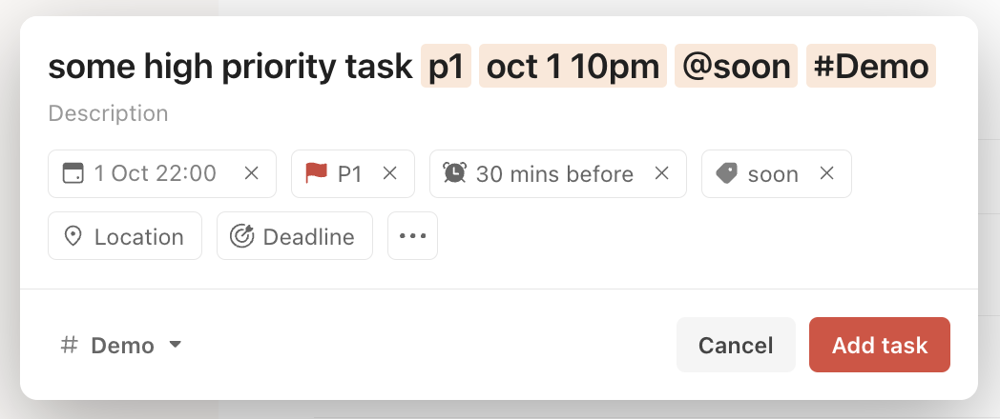
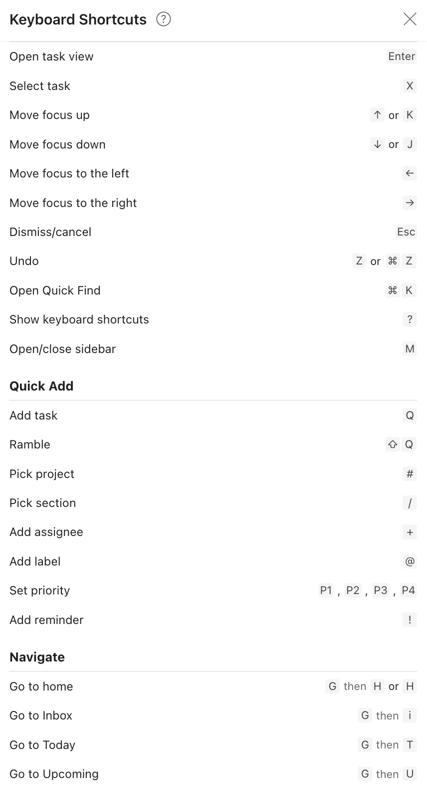
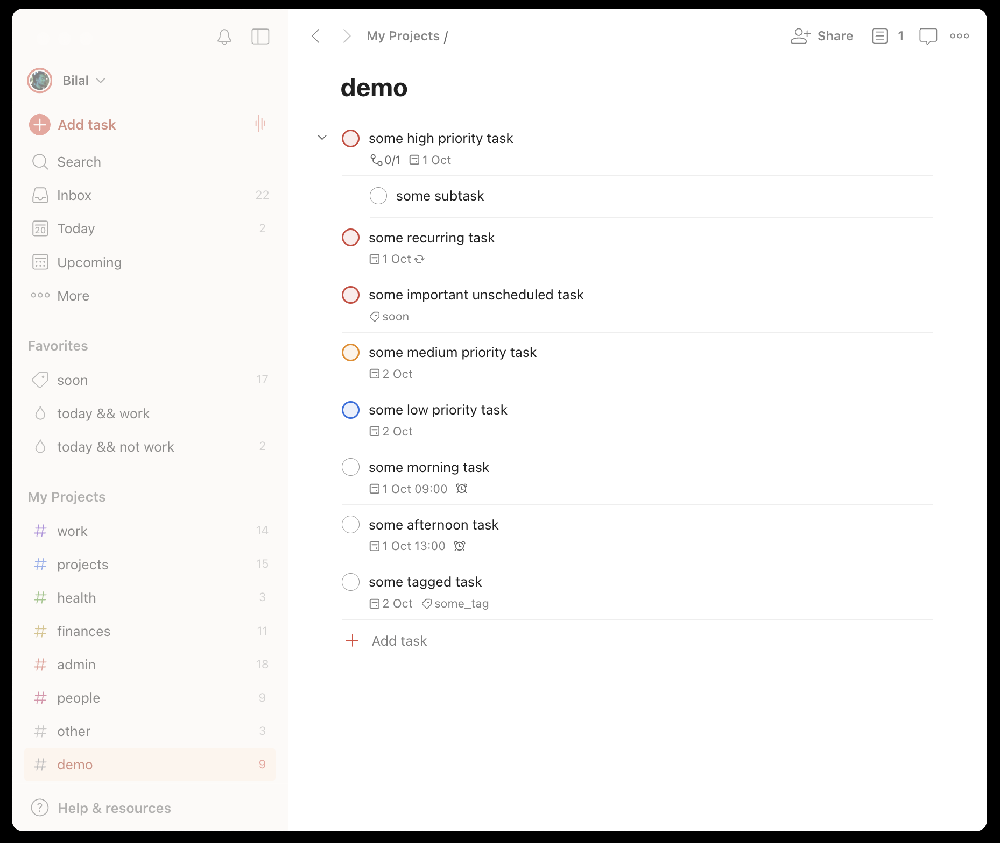
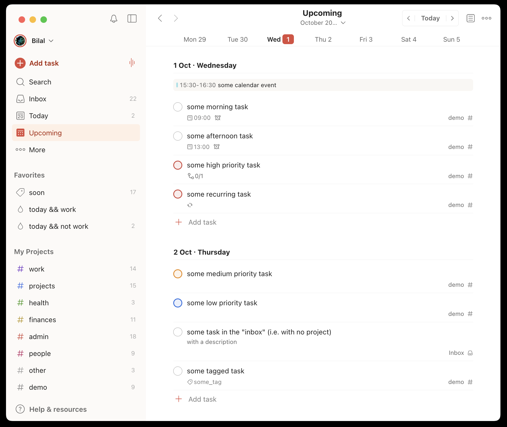
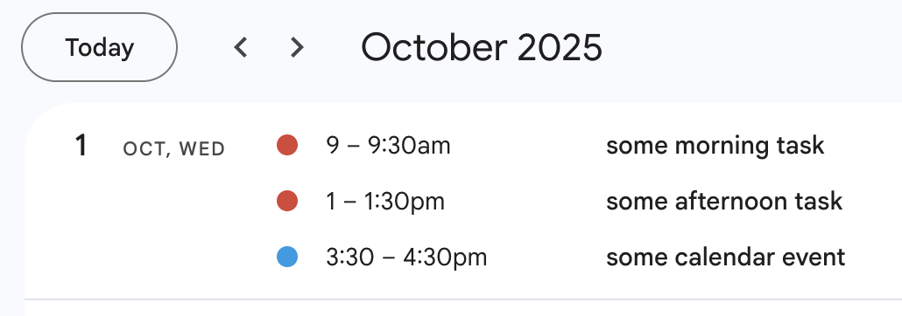
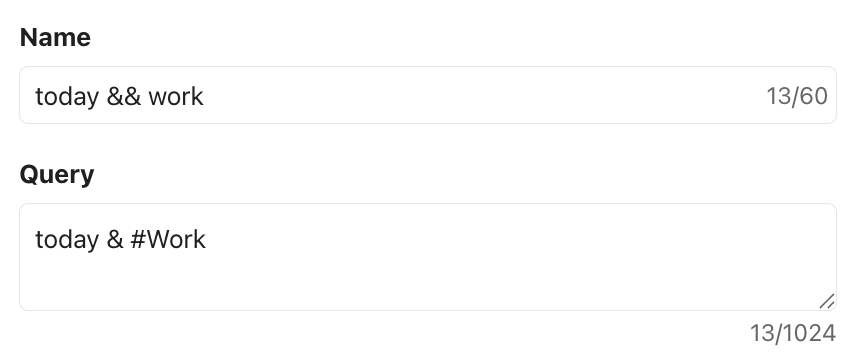

# Introduction

Building a to-do system you actually stick to and use consistently is difficult. It took me significant iteration to nail mine. But now that I have, it acts as my second brain.[^1] I would be completely lost without it.[^2] You might want to consider spending some time either creating or dialling your to do system too.[^3] This post aims to help you do so.

Why should you care about having a good to-do system? A good to-do system solves three distinct _problems_.

<ol type="a">
  <li><strong>Forgetting tasks</strong>. The event that most counterfactually led to me developing my current system was completely forgetting to follow up on a career opportunity; a potentially pretty costly mistake.</li>
  <li><strong>Mental clutter</strong>. Having to remember everything you need to do, even if in principle possible, is <em>also</em> costly, as retaining your entire to-do list in working memory will reduce the amount of focus and attention you can pay to the task you are currently working on. As someone who finds mental clutter pretty distracting, not having a good to do system was historically particularly costly for me.</li>
  <li><strong>Bad prioritization</strong>. A good to do system helps you more efficiently and correctly choose the what task to do next. It <a href="https://www.lesswrong.com/posts/4WLQvcgDWxeuFRymz/ai-and-wisdom-1-wisdom-amortised-optimisation-and-ai">amortises</a> some of the cost of planning.</li>
</ol>

In the remainder of this post, I discuss my high level philosophy behind good to do systems, an opinionated set of general principles based on my experience iterating on mine over the years, demo my current system, and finally discuss some exceptional cases where I think it's actually okay (and personally do) defect from these principles. AIs tell me the below principles have significant overlap with ideas from David Allen's [Getting Things Done](https://en.wikipedia.org/wiki/Getting_Things_Done) and Cal Newport's [Deep Work](https://www.goodreads.com/book/show/25744928-deep-work), though I've never read either.

# What makes a good to do system?

It's instructive to think about when we might use a to-do system before discussing how to build a good one.

I find myself firing up my to do system to do one of the four following _activities_:

1. I think of some new task, and want to **add** it.
2. I want to **plan** out my day or week, or figure out what to do next.
3. I want to check off some task as **complete**.
4. I want to perform **maintenance**: e.g. edit some tasks, delete stale tasks, etc.

So, what makes a to do system _good_? At minimum, it should solve _problems_ a-c via letting you do _activities_ 1-4 above. A further key property it should have is that of **reducing cognitive load** when thinking about tasks. If your system is somehow increasing it, you are doing something wrong, and should probably iterate to reduce that. The most common way systems of mine have failed historically is via insufficiently reducing cognitive load (and even sometimes increasing it!).

## Principles 

With that in mind, here are my concrete importance ordered principles for building a good to-do system.

**Adding tasks should be low friction**. If adding tasks is high friction, you will just not do it when your discipline levels are low or tiredness levels are high. Low friction in this context means "with few actions". So concretely, this means you should both be able to add the task and tag and organize it easily. It is hard to get to a to do system to literally zero friction, but getting any habit as close as possible to a [zero-effort](<https://www.benkuhn.net/zero/) habit will improve the probability you stick to it immensely.

**It should be possible to add tasks as soon as you think of them, and check tasks off as complete as soon as you complete them.** If you cannot, you will need to do one of the following. One option is to retain the new/completed task in working memory until some point you can access your system. This risks you either forgetting the task or cluttering your working memory. Another option is to maintain a "task cache" somewhere you do have instant access to, and then later sync said cache to the ground truth system. This is obviously risky and so will inevitably at some point break. Note that new tasks can be tasks to create tasks, e.g. "deal with X" can be quickly jot down, and then later refined.

**All tasks should not be visible all of the time**. In the high task regime especially, it is costly to be reminded of everything you ever need to do every time you want to add a new task, check off a task as complete, or figure out what to do next. Trust me, you do not want to be stressing or distracted by your tax return that is not due for another 8 months. [Attention is your scarcest resource](https://www.benkuhn.net/attention/), so most tasks should be hidden from you until you need or choose to see them. I think of this as a form of self-[context engineering](https://simonwillison.net/2025/Jun/27/context-engineering/), and also apply this principle in many other settings. For instance, when working on some task X, I try to close all irrelevant apps to stay maximally focussed. Using dedicated desktop apps as opposed to browser apps helps a bunch with this. For more tips, tricks and ideas for keeping focussed, see [here](https://www.benkuhn.net/focustools/).

**It should be easy to surface relevant tasks when needed.** I currently have 118 tasks in my to-do system. Besides it being costly be reminded of all of them every time as discussed above, it is also intractable to sift through that entire list constantly when planning out my day. In practice, this therefore means powerful tagging and filtering tools and views. You might want a tag for each topic of task (e.g. work, finances, etc), for tasks you can do at home, tasks which are due soon, etc. **Context switching is hard**, so being able to aggregate and batch similar tasks is useful. (Fuzzy) search is sometimes helpful, but I rarely find myself using it as I generally feel very free to forget tasks in my to do system completely from my brain. This is only possible because after years of use, I now fully trust the protocol.[^4]

**Tasks should optionally have date, and should be able to be viewed by date.** It's pretty helpful to know which tasks have deadlines, and if any of those are soon. My to do software allows me to set both "dates" for when I plan to do a task, and "deadlines" which are hard cut offs by which some task must be completed. Often tasks are blocked until some event out of your control occurs, and it is useful to mark a task as not relevant until after some date has passed. It can also be helpful to move tasks into "due today", when planning a daily to-do list.

**Tasks should be able to be prioritised as more or less important.** On the one extreme, some tasks absolutely must happen. On the other, some might never be worth doing, but are still useful to jot down somewhere. It is useful to have some sort of view that filters out low priority tasks or sorts tasks by priority. Some people like using @someday and @maybe tags for this sort of thing. It can also be useful to mark tasks as "vaguely urgent" but without a specific date, using e.g. @soon.

**Some tasks recur.** Many tasks recur on a regular cadence. Paying bills, cleaning, watering your plants, etc. You should not have to make a new task for each instance of a recurring task, as this is high friction. The feature to recur a task is very helpful.

**Regular reviews are important.** Tasks go stale. It is important to regularly review everything in your to-do system and delete things that have become irrelevant, and to surface things that have changed priority. Perhaps schedule a recurring monthly task to do so, to batch this work.

**It should interface nicely with your calendar.** A calendar event in some sense is a task, but it's a special kind of task that does not need to be checked off as complete; it completes by default at the end of the allotted time. This distinction makes using a calendar as a to-do system problematic (as you risk forgetting to do a task in the allotted window, and then not being reminded of it again in future), and using a to-do system as a calendar annoying (as you need to check off things that should just get checked off by default). Calendar integration _is_ useful though, as when planning your tasks for the day, it is useful to see what calendar events you have. If you **time box tasks** it can also be useful to see those on your calendar.

# My setup

I use and recommend the fantastic [todoist](https://todoist.com/) software.[^5] I've been using and have been happy with todoist for >2 years. I suspect there are also other good options.[^6]

Before using todoist, I tried various other systems, in various different form factors. Over the years, I've experimented with using a paper, a whiteboard, google tasks and google calendar. In my view these all have problems with sufficient scale, but can work for smaller task lists (and in fact, I do still use simpler systems in certain cases, see the exceptions section below for details). My to-do system eventually outgrew all of the above for reasons that I already explain in the principles section.

Here's what my todoist set up looks like, for inspiration. You probably shouldn't copy it exactly. I've iterated towards this over the course of years, and in general try to only add complexity when I'm certain it will be helpful. When I just started out, the total complexity was significantly lower.

**Adding tasks.** One feature I find essential for reducing friction to add tasks is being able to create tasks entirely via natural language using my keyboard, instead of needing to click through various buttons. I do so as follows, by firing up this window via hitting "q" and then typing in the literal string seen below.

**Keyboard shortcuts**. Todoist has great keyboard shortcuts and can be interacted with entirely without a mouse:

Below I've created a bunch of tasks in the "demo" project with various hopefully self explanatory properties. 

**Surfacing tasks and planning**. The project view above is helpful for surfacing related tasks to get to when planning out a day. I then mostly plan my days by assigning the current date to tasks (via the natural language string "tod") and then staring at the "upcoming" view:

**Tags.** I use the "@soon" tag to mark things to get to soon but with no fixed date. I have a view to easily view all my "soon" tagged tasks. I should probably migrate to using only tags instead of projects, as a task can be marked with multiple tags but only one project (tags > directories in general for this reason). @soon is the only tag I currently use, and when looking for things to do it is often where I default.

**Recurring tasks.** I schedule recurring tasks often for things like household chores and reviews that I should do on some fixed cadence.

**Calendar sync.** Todoist has a two-way calendar sync, so time boxed tasks will show up on my google calendar, and calendar events will show up in my todoist interface (I discuss above what I think of as a task and what I think of as a calendar event). You can also show all of your tasks for a particular day in your calendar, including those which don't have a specific time attached, but I find this chaotic so don't. It also has the nice feature that completed time boxed tasks show up with a ✔️ in my calendar. 

**More complex filters and views.** I have a dedicated "work" project, and two associated filter views to separate todays work tasks from personal tasks. This is helpful because I often don't want to see personal stuff while at the office, or work stuff on a sunday night.

# When to break the rules

The vast majority of my tasks make it into todoist and abide by the above principles. There are a few categories of exceptions.

One general category of exception are cases where simplicity is sufficient so wins out.

- **Linear projects**. Some projects, especially medium-sized solo projects, are extremely linear; meaning there is usually an obvious next task to do every time I sit down to work on that project. There is a single thread of work, that is rarely blocked on other people or external events. I retain the ground truth task list for these sorts of projects in an associated Obsidian markdown file. The extent to which this interfaces with my main to do system is via scheduling time to work on the project at all, or jotting down ideas when on the go (which then get moved into Obsidian notes).
- **Co-locating.** Sometimes it is useful to co-locate small tasks with the thing the task pertains to. Adding a `#TODO` in code is one such example.

Some other exceptions:

- **Calendar events**. As discussed above, a calendar event is not quite a task. These do get synced into todoist, so show up in the UI, but with ground truth in Google Calendar.
- **Large collaborative projects.** Imposing your extremely specific to do system and software onto collaborators is generally not a good idea. Do whatever you want for your personal tasks on the project, but it's usually best to use familiar tools for shared task lists, e.g. [Jira](https://www.atlassian.com/software/jira) / [Asana](https://asana.com/) / Google Docs / whatever else your organisation uses.

 

---

 

_Thanks to Hannah Erlebach for organizing a retreat where I built the first version of my current to-do system. Thanks to Cindy Wu, Jeevan Fernando and Neel Nanda for helpful feedback on drafts and discussion._

 

[^1]: I also have a third and fourth brain, namely Obsidian and my Google Calendar, but those are beyond the scope of this post, and also somewhat conceptually simpler.
[^2]: Recently, a friend asked me what I was up to for the rest of the day and prohibited me from checking my to-do system. I struggled.

[^3]: In general, I think people systematically neglect spending time on workflow improvements. I expect in the AI era, where the rate at which new workflows become possible is increased, you should probably be spending even more time on workflow iteration than normal. Recently, I've been spending something like a day a week on improving workflows.

[^4]: AIs might make fuzzy search more efficient here, though I've not yet seen a good implementation. I'm currently building my own.

[^5]: If relevant, todoist also has a good [API](https://developer.todoist.com/api/v1/).

[^6]: Though will note I found [Linear](https://linear.app/) to be a bit overengineered and complex for personal use cases.